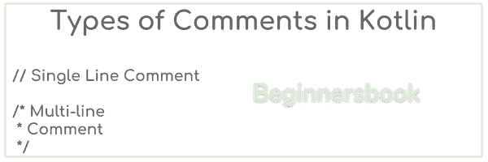

# 科特林评论

> 原文： [https://beginnersbook.com/2018/09/kotlin-comments/](https://beginnersbook.com/2018/09/kotlin-comments/)

**评论**是程序的重要组成部分，它提高了代码的可读性，使其更易于理解。在代码中编写有意义的注释被认为是一种很好的编程实践。与 [Java](https://beginnersbook.com/java-tutorial-for-beginners-with-examples/) 类似，Kotlin 也支持单行和多行注释。 Kotlin 中**注释的语法与 Java 相同。**

## 什么是评论？

注释是程序员在代码的各个位置编写的有意义的文本，用于解释代码的目的和逻辑。编写注释是为了提高代码的可读性，它们在程序的编译和执行中不起作用，编译器在编译期间完全忽略它们。

## Kotlin 中的评论类型

Kotlin 有两种类型的评论 - 1）单行注释 2）多行注释


### 1）单行评论

顾名思义，这种评论是写一行评论。单行注释以双斜杠开始，编译器忽略双斜杠后写入的任何文本。

```
fun main(args: Array<String>) {
    //This is a single line comment
    println("Hello World!")
}
```

双斜线后面的文本“这是单行注释”是注释。我已经写了这篇文章来演示注释的使用，但是文本应该解释代码的行或块的目的是什么，所以有意义的注释应该如下所示：

```
fun main(args: Array<String>) {
    //This displays the "Hello World!" message on the output screen
    println("Hello World!")
}
```

### 2）多行评论

在某些情况下，我们需要在几行中解释这段代码，在这种情况下，我们使用多行注释。我们用`/*`开始评论并以`*/`结束评论。

例如：

```
fun main(args: Array<String>) {
    /* This is a multi-line comment. I'm writing this 
     * text to show you that we can write the comments
     * in multiple lines
     */
    println("Hello World!")
}
```