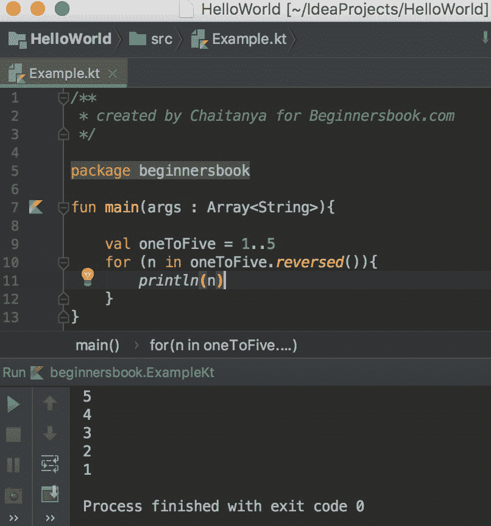

# Kotlin 范围

> 原文： [https://beginnersbook.com/2019/02/kotlin-ranges/](https://beginnersbook.com/2019/02/kotlin-ranges/)

在本指南中，我们将讨论 Kotlin 的非常酷的特征，即**范围**。借助 Kotlin 中的**范围，我们可以通过指定起始值和结束值轻松创建序列列表。例如，`1..5`的范围将创建一系列值`1,2,3,4,5`。类似地，我们可以创建字符范围，例如`'A'..'D'`，它将创建一系列值 `A, B, C, D`。我们也可以按相反顺序创建范围，并使用范围创建其他几个范围。让我们开始吧。**

## Kotlin 范围的一个简单例子

在下面的示例中，我们创建了两个范围，一个是整数范围，另一个是字符范围。我们使用`for`循环遍历范围的元素。

```kotlin
/**
 * created by Chaitanya for Beginnersbook.com
 */

package beginnersbook

fun main(args : Array<String>){

    println("Number range:")

    for(num in 1..4){
        println(num)
    }

    println("Character range:")

    for(ch in 'A'..'E'){
        println(ch)
    }
}
```

**输出：**


## 检查范围中的元素

我们还可以检查范围内是否存在特定元素。让我们看一下如何借助一个简单的例子来做到这一点。

```kotlin
package beginnersbook

fun main(args : Array<String>){

    val oneToTen = 1..10

    println("3 in oneToTen: ${3 in oneToTen}")
    println("11 in oneToTen: ${11 in oneToTen}")
}
```

**输出：**

```kotlin
3 in oneToTen: true
11 in oneToTen: false
```

## Kotlin 范围：`rangeTo()`和`downTo()`函数

而不是..我们可以使用这些函数`rangeTo()`和`downTo()`，`rangeTo()`用于递增顺序而`downTo()`用于递减顺序。

```kotlin
/**
 * created by Chaitanya for Beginnersbook.com
 */

package beginnersbook

fun main(args : Array<String>){

    val oneToFive = 1.rangeTo(5)
    val sixToThree = 6.downTo(3)

    println("rangeTo:")
    for(x in oneToFive){
        println(x)
    }

    println("downTo")
    for(n in sixToThree){
        println(n)
    }
}
```

**输出：**


## Kotlin 范围步长

在`step()`函数的帮助下，我们可以定义值之间的间隔。默认情况下，`step`的值为 1，因此当我们创建范围`1..10`时，它是`1,2,3，... 10`。但是如果我们想要一个像 3 这样的特定区间，那么我们可以像这样定义`1..10.step(3)`这样的范围，这样的值就是`1 4 7 10`。让我们举一个例子。

```kotlin
package beginnersbook

fun main(args : Array<String>){

    val oneToTen = 1..10
    val odd = oneToTen.step(2)

    for(n in odd){
        println(n)
    }
}
```

**输出：**

```kotlin
1
3
5
7
9
```

## Kotlin 范围反转

我们可以使用`reverse()`函数反转 Kotlin 中的范围。

```kotlin
/**
 * created by Chaitanya for Beginnersbook.com
 */

package beginnersbook

fun main(args : Array<String>){

    val oneToFive = 1..5
    for (n in oneToFive.reversed()){
        println(n)
    }
}
```

**输出：**

