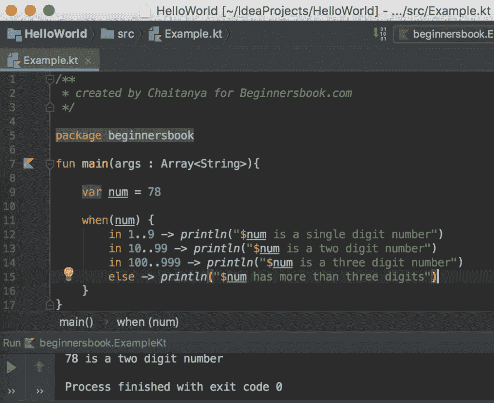

# Kotlin 表达时带有例子

> 原文： [https://beginnersbook.com/2019/02/kotlin-when-expression/](https://beginnersbook.com/2019/02/kotlin-when-expression/)

当 Kotlin 中的表达与 [C](https://beginnersbook.com/2014/01/switch-case-statements-in-c/) ， [C ++](https://beginnersbook.com/2017/08/cpp-switch-case/) 和 [Java](https://beginnersbook.com/2017/08/java-switch-case/) 等其他编程语言中的切换案例相同时，**。**

## Kotlin 表达简单的例子

```
/**
 * created by Chaitanya for Beginnersbook.com
 */
package beginnersbook

fun main(args : Array<String>){

    var ch = 'A'

    when(ch){

        'A' -> println("A is a Vowel")
        'E' -> println("E is a Vowel")
        'I' -> println("I is a Vowel")
        'O' -> println("O is a Vowel")
        'U' -> println("U is a Vowel")

        else -> println("$ch is a Consonant")
    }
}
```

**输出：**

```
A is a Vowel
```

我们也可以用更清洁的方式重写相同的代码，如下所示：

```
/**
 * created by Chaitanya for Beginnersbook.com
 */

package beginnersbook

fun main(args : Array<String>){

    var ch = 'A'

    when(ch){

        'A', 'E', 'I', 'O', 'U' -> println("$ch is a Vowel")

        else -> println("$ch is a Consonant")
    }
}
```

## Kotlin 表达范围时

当表达时，我们也可以在**中使用[范围](https://beginnersbook.com/2019/02/kotlin-ranges/)。在下面的示例中，我们在 when 表达式中使用了多个范围来查找给定数字中的数字。**

```
/**
 * created by Chaitanya for Beginnersbook.com
 */

package beginnersbook

fun main(args : Array<String>){

    var num = 78

    when(num) {
        in 1..9 -> println("$num is a single digit number")
        in 10..99 -> println("$num is a two digit number")
        in 100..999 -> println("$num is a three digit number")
        else -> println("$num has more than three digits")
    }
}
```

**输出：**


## 表达式里面的算术运算

我们还可以对我们在 when 表达式中传递的变量执行操作。

```
/**
 * created by Chaitanya for Beginnersbook.com
 */

package beginnersbook

fun main(args : Array<String>){

    var age = 16

    when(age) {
        in 1..17 -> {
            val num = 18 - age
            println("You will be eligible for voting in $num years")
        }
        in 18..100 -> println("You are eligible for voting")
    }
}
```

**输出：**
