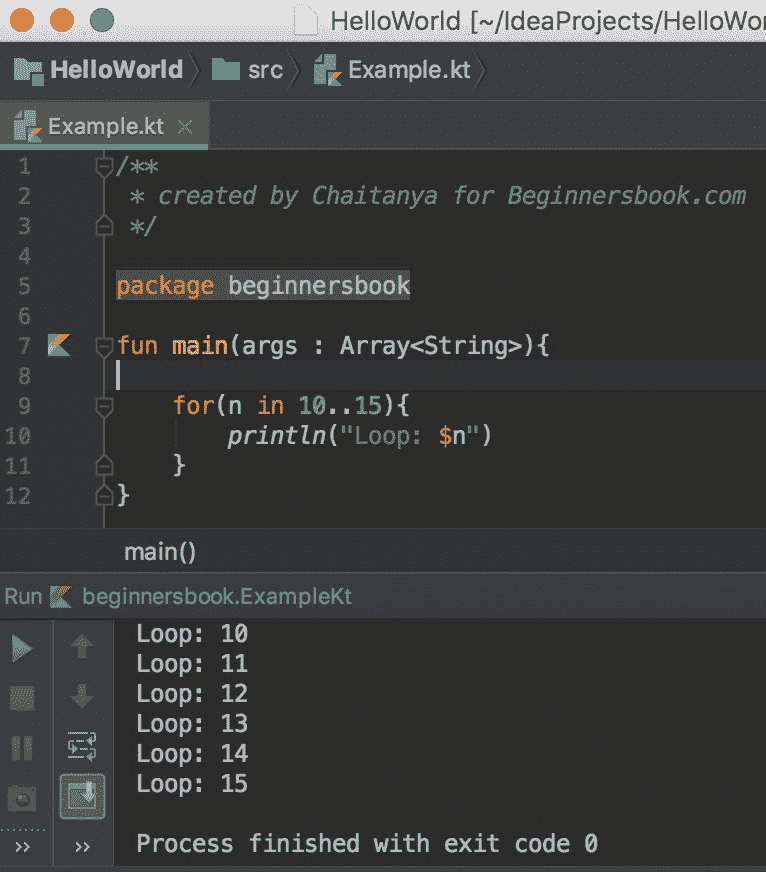
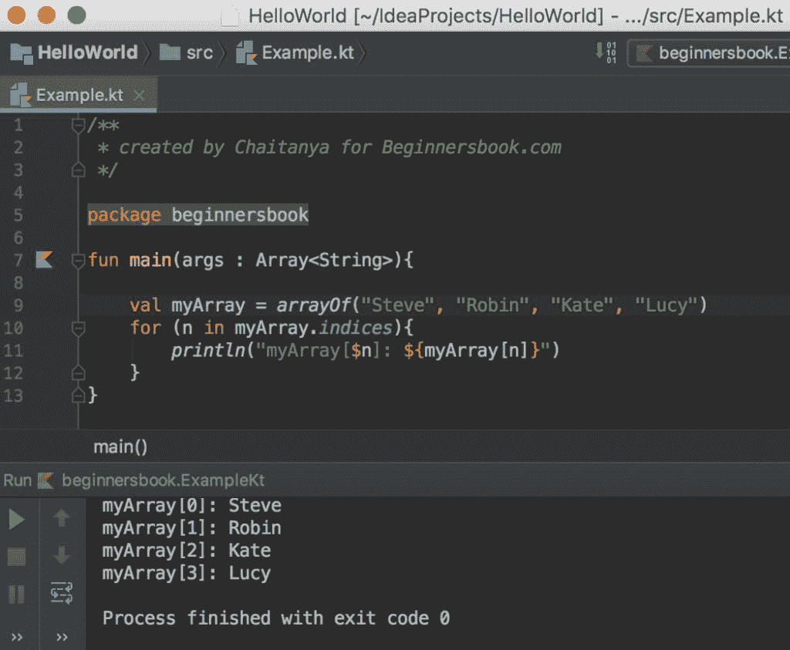

# Kotlin `for`循环

> 原文： [https://beginnersbook.com/2019/02/kotlin-for-loop/](https://beginnersbook.com/2019/02/kotlin-for-loop/)

Kotlin 中的`for`循环用于迭代或循环[数组](https://beginnersbook.com/2019/02/kotlin-array/)，[范围](https://beginnersbook.com/2019/02/kotlin-ranges/)，集合等元素。在本指南中，我们将学习如何在 Kotlin 中使用`for`循环各种例子的帮助。

## Kotlin 中`for`循环的一个简单例子

在下面的示例中，我们使用 for 循环遍历整数范围。

```kotlin
/**
 * created by Chaitanya for Beginnersbook.com
 */

package beginnersbook

fun main(args : Array<String>){

    for(n in 10..15){
        println("Loop: $n")
    }
}
```

**输出：**



## Kotlin `for`循环遍历`Array`

在下面的例子中，我们声明了一个数组`myArray`，我们使用`for`循环显示数组的元素。

```kotlin
package beginnersbook

fun main(args : Array<String>){

    val myArray = arrayOf("ab", "bc", "cd", "da")
    for (str in myArray){
        println(str)
    }
}
```

**输出：**

```kotlin
ab
bc
cd
da
```

## Kotlin `for`循环遍历数组索引

我们还可以使用数组索引来遍历数组。

```kotlin
/**
 * created by Chaitanya for Beginnersbook.com
 */

package beginnersbook

fun main(args : Array<String>){

    val myArray = arrayOf("Steve", "Robin", "Kate", "Lucy")
    for (n in myArray.indices){
        println("myArray[$n]: ${myArray[n]}")
    }
}
```

**输出：**



## 在`for`循环中使用`withIndex()`函数

在上面的例子中，我们使用数组索引遍历数组。另一种方法是使用`withIndex()`函数。

```kotlin
package beginnersbook

fun main(args : Array<String>){

    val myArray = arrayOf("Steve", "Robin", "Kate", "Lucy")
    for((index, value) in myArray.withIndex()){
        println("Value at Index $index is: $value")
    }
}
```

**输出：**

```kotlin
Value at Index 0 is: Steve
Value at Index 1 is: Robin
Value at Index 2 is: Kate
Value at Index 3 is: Lucy
```