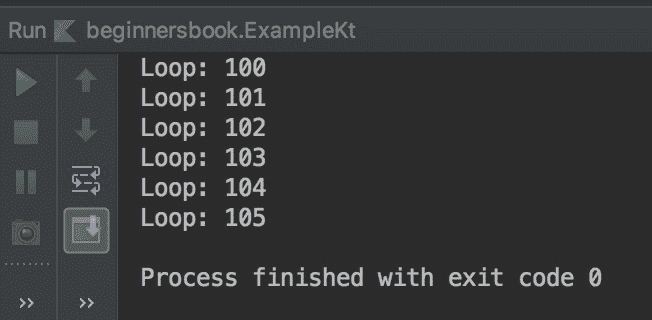
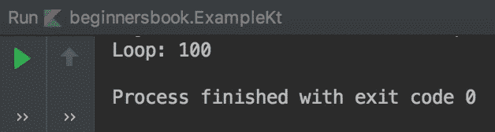

# Kotlin `do-while`循环

> 原文： [https://beginnersbook.com/2019/02/kotlin-do-while-loop/](https://beginnersbook.com/2019/02/kotlin-do-while-loop/)

`do-while`循环类似于[`while`循环](https://beginnersbook.com/2019/02/kotlin-while-loop/)，除了它在迭代结束时检查条件。即使给定条件为假，`do-while`循环也至少会运行一次。

## Kotlin `do-while`循环示例

```kotlin
/**
 * created by Chaitanya for Beginnersbook.com
 */

package beginnersbook

fun main(args : Array<String>){

    var num = 100
    do {
        println("Loop: $num")
        num++
    }
    while (num<=105)
}
```

**输出：**



## `do-while`循环至少运行一次

正如我在本指南开头所提到的，即使给定条件返回`false`，`do-while`循环也至少会运行一次。发生这种情况是因为`do-while`循环在执行循环体之后检查条件。

```kotlin
/**
 * created by Chaitanya for Beginnersbook.com
 */

package beginnersbook

fun main(args : Array<String>){

    var num = 100
    do {
        println("Loop: $num")
        num++
    }
    while (false)
}
```

**输出：**



## Kotlin 无限循环

一个无限运行且永不停止的`while`循环称为无限循环。让我们看一下无限循环的几个例子。

**例 1：**

```kotlin
var num = 100
do {
    println("Loop: $num")
    num++   
}
while (true)
```

**例 2：**

```kotlin
var num = 100
do {
    println("Loop: $num")
    num--  
}
while (num<=105)
```

**例 3：**

```kotlin
var num = 105
do {
    println("Loop: $num")
    num++
}
while (num>=100)
```