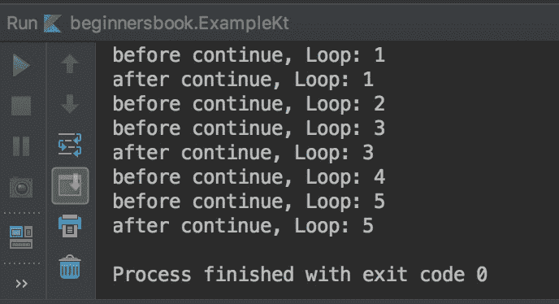
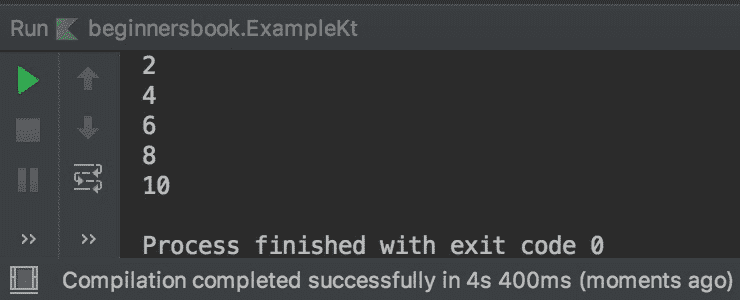

# Kotlin `continue`表达式

> 原文： [https://beginnersbook.com/2019/02/kotlin-continue-expression-with-examples/](https://beginnersbook.com/2019/02/kotlin-continue-expression-with-examples/)

`continue`构造跳过循环的当前迭代并将控制流跳转到循环结束以进行下一次迭代。`continue`通常与[`if`表达式](https://beginnersbook.com/2018/09/kotlin-if-else-expression/)一起使用，以跳过指定条件的循环的当前迭代。在本指南中，我们将学习`cintinue`构造和标签。

## Kotlin `continue`循环示例

```kotlin
fun main(args : Array<String>){

    for (n in 1..5){
        println("before continue, Loop: $n")
        if(n==2||n==4)
            continue

        println("after continue, Loop: $n")

    }
}
```

**输出：**



正如您在输出中看到的那样`println("after continue, Loop: $n")`语句没有为循环迭代`n == 2`和`n == 4`执行，因为在这些迭代中我们使用了此语句之前的`continue`，它跳过了这些`n`值的迭代。

但是，您可以观察到在每次迭代时执行的`println("before continue, Loop: $n")`语句，因为它在遇到`Continue`之前执行。

基于此，您可以得出结论`continue`跳过迭代，但它无法跳过`continue`之前遇到的语句。一旦遇到`continue`，控制流就跳转到循环的末尾，跳过其余的语句。

让我们再看一个例子

## Kotlin `continue`：显示偶数

```kotlin
fun main(args : Array<String>){

    for (n in 1..10){
        if(n%2!=0)
            continue

        println("$n")

    }
}
```

**输出：**



## `continue`标签

直到现在我们已经学会了`continue`。让我们了解`continue`标签。这些标签很酷，基本上它们在我们处理嵌套循环时给予我们更多的控制。

让我们举一个例子，我们首先不使用`continue`标签，然后我们将采用与`continue`标签相同的例子。

**没有`continue`标签的嵌套循环示例**

在这个例子中，我们有一个嵌套的`for`循环，我们没有使用标签。当我们不使用标签时，我们没有任何控制，一旦遇到`continue`，就会跳过**内循环**的当前迭代。

```kotlin
fun main(args : Array<String>){

    for (x in 'A'..'D'){
        for (n in 1..4){
            if (n==2||n==4)
                continue

            println("$x and $n")
        }

    }
}
```

**输出：**

```kotlin
A and 1
A and 3
B and 1
B and 3
C and 1
C and 3
D and 1
D and 3
```

**带有`continue`标签**的嵌套循环示例

您可以在上面的示例输出中看到，对于`n`值 2 和 4，内循环将跳过迭代。让我们说我们想跳过外部`for`循环的迭代，我们可以在`continue`标签的帮助下这样做。

```kotlin
fun main(args : Array<String>){

    mtloop@ for (x in 'A'..'D'){
        for (n in 1..4){
            if (n==2||n==4)
                continue @myloop

            println("$x and $n")
        }

    }
}
```

**输出：**

```kotlin
A and 1
B and 1
C and 1
D and 1
```

基本上这里发生的是，一旦`n`值达到 2，控制流就会因为标签而跳到外循环的末尾，并且每次迭代都会发生这种情况。`continue `标签的语法非常简单，因为您只需要在标签后附加`@`符号，并且需要在`continue`语句后附加相同的名称，如上例所示。