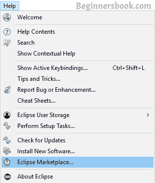
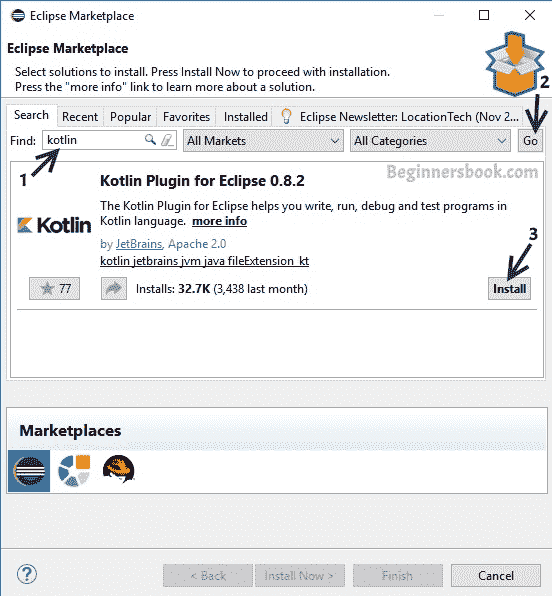
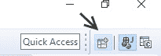
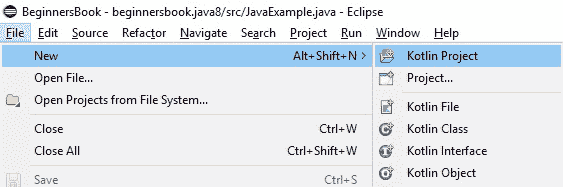
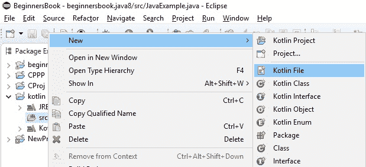
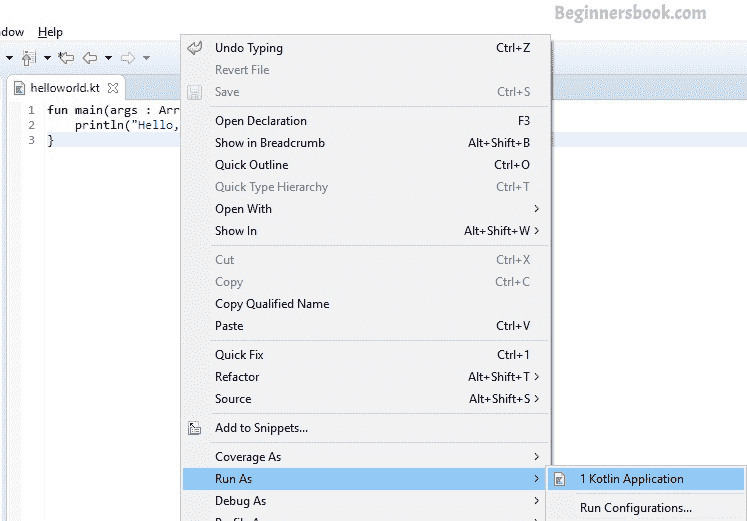
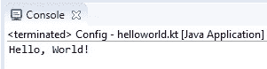

# 在 Eclipse IDE 中创建并运行您的第一个 Kotlin 项目

> 原文： [https://beginnersbook.com/2017/12/kotlin-in-eclipse-ide/](https://beginnersbook.com/2017/12/kotlin-in-eclipse-ide/)

在本教程中，我们将了解如何在 Eclipse IDE 中安装 Kotlin 插件，以在 **Eclipse IDE** 中创建和运行**第一个 Kotlin 应用程序**。

## 安装 Kotlin 插件

**第 1 步：**如果你没有[安装了 Eclipse IDE](https://beginnersbook.com/2016/04/how-to-install-eclipse-on-mac-os-x/) ，你可以从这个链接下载它： [https://www.eclipse.org/downloads/](https://www.eclipse.org/downloads/) Be 一定要抓住“Eclipse IDE for Java Developers”捆绑包。要在 Eclipse IDE 中运行 Kotlin，您必须具有 Eclipse Neon 或更高版本的 IDE。我正在使用 Elipse Oxygen。

**第 2 步：**要在 Eclipse 中安装 Kotlin 插件，请转到 Eclipse IDE 菜单中的 Help 部分，然后单击“Eclipse Marketplace”。在搜索字段中键入“Kotlin”搜索 kotlin 插件，然后单击 go。单击安装以安装 Kotlin 插件，如下面的屏幕截图所示。


**步骤 3：**安装完成后，接受协议并单击“完成”。

## 在 Eclipse IDE 中打开 Kotlin 透视图

单击下面屏幕截图中显示的图标，打开 Eclipse IDE 中的 Perspective 窗口。您可以在 Eclipse IDE 的右上角找到此图标。或者，您可以从菜单窗口打开透视窗口 - &gt;开放视角 - &gt;其他。

选择 Kotlin 并单击“打开”。


## 在 Eclipse 中创建第一个 Kotlin 项目

档案 - &gt;新 - &gt; Kotlin 项目。提供项目名称并单击“完成”。


## 在 Kotlin 项目中创建项目文件

项目 - &gt;右键单击 src-&gt; New-&gt; Kotlin 文件。提供有意义的文件名并单击“完成”。 Kotlin 文件的扩展名为.kt。

在文件中输入以下代码：

```
fun main(args : Array) {
    println("Hello, World!")
}
```

## 运行第一个程序

右键单击文件 - &gt;运行 As-&gt; Kotlin 应用程序


输出：
