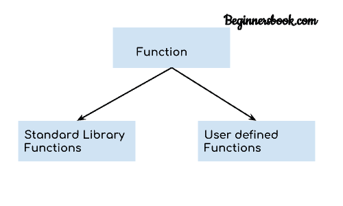
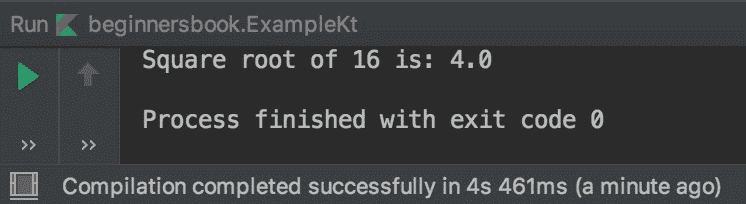

# Kotlin 功能与例子

> 原文： [https://beginnersbook.com/2019/02/kotlin-function/](https://beginnersbook.com/2019/02/kotlin-function/)

函数是一起执行特定任务的相关语句块。例如，假设我们必须编写三行代码来查找两个数字的平均值，如果我们创建一个函数来查找平均值，那么我们可以只调用我们创建的函数，而不是一次又一次地写这三行。

## Kotlin 中的函数类型

Kotlin 中有两种类型的函数：

1.  标准库函数
2.  用户定义的函数



## 1.标准库功能

已经存在于 Kotlin 标准库中的函数称为标准库函数或内置函数或预定义函数。例如，当我们需要使用 Math.floor（）函数时，我们不定义函数，因为它已经存在，我们可以在代码中直接调用它。

### 标准库函数示例

```kotlin
fun main(args : Array<String>){

    var num = 16
    println("Square root of $num is: ${Math.sqrt(num.toDouble())}")

}
```

**输出：**



## 2.用户定义的功能

我们在调用它们之前在程序中定义的函数称为用户定义的函数。例如，假设我们想要一个函数在我们的程序中检查偶数或奇数，然后我们可以为此任务创建一个函数，然后调用我们需要执行检查的函数。

### 用户定义的函数示例

我们使用`fun`关键字创建一个函数。让我们创建一个打印“Hello”的函数。

```kotlin
//Created the function
fun sayHello(){
    println("Hello")
}
fun main(args : Array<String>){

    //Calling the function
    sayHello()

}
```

**输出：**

```kotlin
Hello
```

### 用户定义的函数，带参数和返回类型

**语法：**

```kotlin
fun function_name(param1: data_type, param2: data_type, ...): return_type

```

让我们创建一个用户定义的函数，接受参数并具有返回类型。在下面的程序中，我们声明了一个函数`sum`。这个函数接受可变数量的参数，这就是我们使用`vararg`的原因，这些参数是整数类型，函数的返回类型也是整数。

```kotlin
//Created the function
fun sum(vararg numbers: Int): Int
{
    var sum = 0
    numbers.forEach {num -> sum +=  num}

    return sum
}
fun main(args : Array<String>){

    println("Sum: ${sum(10, 20, 30, 40)}")

}
```

**输出：**


## Kotlin 内联功能

可以在 main（）函数内定义内联函数。让我们举一个内联函数的例子。在下面的例子中，我们定义了一个内联函数`sum`，它接受两个整数参数`num1`和`num2`，返回类型是整数。

```kotlin
fun main(args : Array<String>){

    val sum = {num1: Int, num2: Int -> num1 + num2}

    println("6 + 4 = ${sum(6,4)}")

}
```

**输出：**

```kotlin
6 + 4 = 10
```