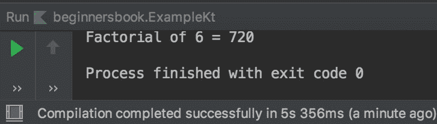

# Kotlin 递归和尾递归与示例

> 原文： [https://beginnersbook.com/2019/03/kotlin-recursion-and-tail-recursion/](https://beginnersbook.com/2019/03/kotlin-recursion-and-tail-recursion/)

如果函数调用自身，则该函数称为**递归函数**，此过程称为**递归**。

## 递归函数如何看起来像？

这里函数`myfunction()`调用自身，这是一个递归函数。

```kotlin
fun myfunction(){    
  //some code  
  ....
  //myfunction() calling myfunction()
  myfunction()   
}
```

让我们举个例子来理解递归。

## Kotlin 递归示例

这是阶乘的一个简单例子。这里我们定义了一个函数`fact()`来计算它作为参数传递给该函数的数字的阶乘。在函数体中我们再次调用此函数，此过程称为递归。

要求用户输入正整数，并根据输入，程序通过将输入数作为参数传递给[用户定义函数](https://beginnersbook.com/2019/02/kotlin-function/) `fact()`来查找输入数的阶乘。

```kotlin
fun main(args: Array<String>) {
    print("Enter a positive integer number: ")
    val number: Int =Integer.valueOf(readLine())
    val factorial = fact(number)
    println("Factorial of $number = $factorial")
}

//recursive function
fun fact(num: Int): Int {
    return if(num == 1){
        num
    }
    else{
        //function fact() calling itself
        num*fact(num-1)
    }
}
```

**输出：**


## 尾递归

在递归中，计算在递归调用之后完成，我们在上面看到的阶乘的例子是递归或头递归的一个例子，其中计算 n 的阶乘，我们需要 n-1 的阶乘。

在 **Tail 递归**中，计算在递归调用之前的开始处完成。在尾递归中，递归函数的调用发生在函数的末尾。这意味着首先完成计算，然后传递给下一个递归调用。

让我们举一个尾递归的例子。

### 尾递归示例

要声明尾递归函数，我们在函数之前使用`tailrec`修饰符。

```kotlin
fun main(args: Array<String>) {
    val number = 6
    val factorial = fact(number)
    println("Factorial of $number = $factorial")
}

tailrec fun fact(n: Int, temp: Int = 1): Int {
    return if (n == 1){
        temp
    } else {
        fact(n-1, temp*n)
    }
}
```

**输出：**

