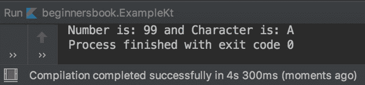
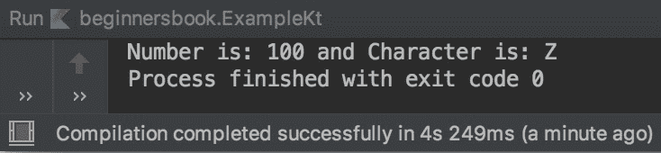

# Kotlin 默认和命名参数

> 原文： [https://beginnersbook.com/2019/03/kotlin-default-and-named-argument/](https://beginnersbook.com/2019/03/kotlin-default-and-named-argument/)

在本指南中，我们将学习在 [Kotlin 函数](https://beginnersbook.com/2019/02/kotlin-function/)中使用的**默认和命名参数**。

## Kotlin 默认参数

我们已经学习了函数如何具有参数，并且我们可以在调用函数时传递这些参数的值，通过使用默认参数，我们可以在定义函数时设置这些参数的默认值。让我们举个例子来理解默认参数。

### 默认参数示例

**函数调用期间未传递任何值**

```
fun main(args: Array<String>) {
    demo()
}
fun demo(number:Int= 100, ch: Char ='A'){
    print("Number is: $number and Character is: $ch")
}
```

**输出：**

```
Number is: 100 and Character is: A
```

在上面的例子中，我们在调用函数`demo()`时没有传递任何值，让我们看看当我们将值传递给已经为其参数设置了默认值的函数时会发生什么。

**在函数调用期间传递一些参数值**

```
fun main(args: Array<String>) {
    demo(99)
}
fun demo(number:Int= 100, ch: Char ='A'){
    print("Number is: $number and Character is: $ch")
}
```

**输出：**



正如您在输出中看到的那样，当我们在调用函数时传递值时，它会覆盖默认值。在上面的例子中，我在调用函数时传递了一个值，这就是为什么它只覆盖第一个默认值，但是我们也可以为所有参数传递值，这将覆盖所有默认值。

**在函数调用期间传递所有参数的值**

```
fun main(args: Array<String>) {
    demo(99, 'Z')
}
fun demo(number:Int= 100, ch: Char ='A'){
    print("Number is: $number and Character is: $ch")
}
```

**Output:**

```
Number is: 99 and Character is: Z
```

## Kotlin 被命名为争论

在上面的例子中，我们学习了如何设置参数的默认值。在第二个例子中我们了解到我们可以在传递几个值时调用函数，我们在第二个例子`demo(99)`中进行了这样的函数调用，它会覆盖第一个默认值。但是，如果我们只想覆盖第二个默认值，那么我们可以在**命名参数**的帮助下完成。

```
fun main(args: Array<String>) {
    demo(ch='Z')
}
fun demo(number:Int= 100, ch: Char ='A'){
    print("Number is: $number and Character is: $ch")
}
```

**输出：**


如您所见，我们在函数调用`demo(ch='Z')`期间使用参数名称覆盖了第二个参数的默认值。如果我们在没有像`demo('Z')`这样的命名参数的情况下完成此操作，则会抛出错误，因为它会尝试使用此值覆盖第一个整数参数。