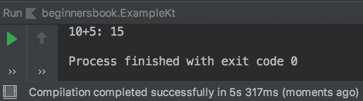

# Kotlin Lambda 功能示例

> 原文： [https://beginnersbook.com/2019/03/kotlin-lambda-function/](https://beginnersbook.com/2019/03/kotlin-lambda-function/)

[Lambda](https://beginnersbook.com/2017/10/java-lambda-expressions-tutorial-with-examples/) 函数也称为匿名函数，因为它没有名称。参数位于箭头的左侧，实际代码位于箭头的右侧。别担心，我们会举一个例子来解释这一点。

## Lambda 函数的外观如何？

```
{my_var -> actual_code_implementation}
```

## Kotlin Lambda 函数示例

在下面的示例中，我们定义了一个 lambda 函数来添加两个整数。 lambda 函数用花括号定义，箭头的左边是我们的数据类型的参数，箭头的右边是函数体。

```
fun main(args: Array<String>){
    //lambda function
    val sum = {num1: Int, num2: Int -> num1 + num2}
    println("10+5: ${sum(10,5)}")
}
```

**输出：**
