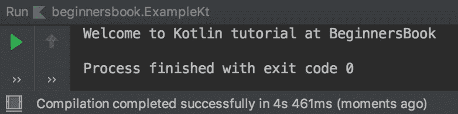
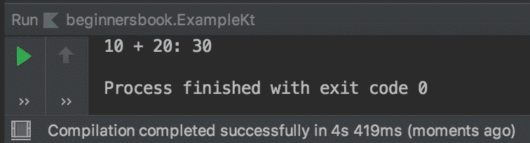

# Kotlin 高阶函数的例子

> 原文： [https://beginnersbook.com/2019/03/kotlin-higher-order-function/](https://beginnersbook.com/2019/03/kotlin-higher-order-function/)

**高阶函数**或更高阶函数可以将另一个函数作为参数或返回函数，或者可以同时执行这两个函数。到目前为止我们已经看到如何将整数，字符串等作为参数传递给函数，但在本指南中，我们将学习如何将函数传递给另一个函数。我们还将看到函数如何返回另一个函数。

## Kotlin 高阶函数示例：将函数传递给另一个函数

在下面的例子中，我们将函数`demo()`传递给另一个函数`func()`。要将函数作为参数传递给其他函数，我们在函数之前使用`::`运算符，如下例所示。

```
fun main(args: Array<String>) {

    func("BeginnersBook", ::demo)

}

fun func(str: String, myfunc: (String) -> Unit) {
    print("Welcome to Kotlin tutorial at ")
    myfunc(str)
}
fun demo(str: String) {
    println(str)
}
```

**输出：**


## Kotlin 高阶函数示例：函数返回另一个函数

在以下示例中，自定义函数`func`正在返回另一个函数。

要理解这段代码，让我们首先看一下函数`func`，它接受一个整数参数`num`，在返回区域我们定义了一个函数`(Int) -&gt; Int = {num2 -&gt; num2 + num}`，所以这是另一个接受整数参数的函数并返回该参数和`num`的总和。

您可能想知道为什么我们将值 20 作为`sum`中的参数传递，这是因为函数`func`返回了函数，因此`sum`是接受 int 参数的函数。这与我们在函数`func`的返回区域中定义的函数相同。

```
fun main(args: Array<String>) {

    val sum = func(10)
    println("10 + 20: ${sum(20)}")

}

fun func(num: Int): (Int) -> Int = {num2 -> num2 + num}
```

**输出：**
