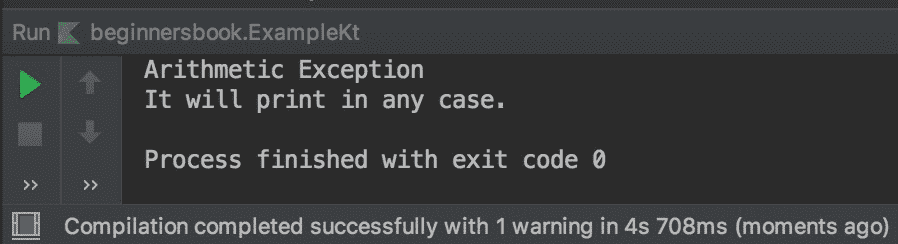
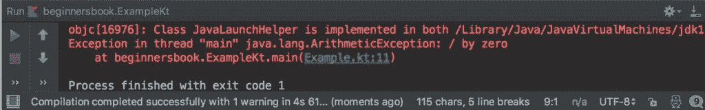
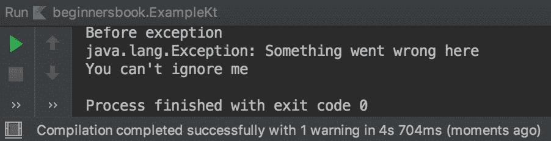

# Kotlin 异常处理示例

> 原文： [https://beginnersbook.com/2019/03/kotlin-exception-handling/](https://beginnersbook.com/2019/03/kotlin-exception-handling/)

例外是在程序运行时可能发生的不必要的问题，并突然终止您的程序。异常处理是一个过程，使用它可以防止程序出现可能破坏我们代码的异常。

有两种类型的异常：
1.已检查的异常声明为方法签名的一部分，并在编译时检查，例如 IOException
2.未经检查的异常不需要作为方法的一部分添加签名，并在运行时检查它们，例如 NullPointerException。

**注意：在 Kotlin 中，所有例外情况都未经检查。**

处理 Kotlin 中的异常与 [Java](https://beginnersbook.com/2013/04/java-exception-handling/) 相同。我们使用 try，catch 和 finally 块来处理 kotlin 代码中的异常。

## Kotlin 异常处理示例

在下面的例子中，我们将一个数字除以 0（零），这应该抛出 ArithmeticException。由于此代码在`try`块中，因此将执行相应的 catch 块。

在这种情况下，发生了 ArithmeticException，因此执行了 ArithmeticException 的 catch 块，并在输出中打印了“Arithmetic Exception”。

当发生异常时，它会忽略该点之后的所有内容，并且控件会立即跳转到 catch 块（如果有的话）。无论是否发生异常，始终执行 finally 块。

```
fun main(args: Array<String>) {
    try {

        var num = 10/0
        println("BeginnersBook.com")
        println(num)

    } catch (e: ArithmeticException) {
        println("Arithmetic Exception")
    } catch (e: Exception) {
        println(e)
    } finally {
        println("It will print in any case.")
    }
}
```

**输出：**


## 如果我们不处理异常会怎么样？

假设我们在上面的例子中没有处理异常，那么程序会突然终止。
这里我们没有处理异常，所以程序因错误而终止。

```
fun main(args: Array<String>) {

        var num = 10/0
        println("BeginnersBook.com")
        println(num)
}
```

**输出：**


## 如何在 Kotlin 中抛出异常

我们也可以使用`throw`关键字抛出异常。在下面的示例中，我们使用 throw 关键字抛出异常。异常执行前的语句已执行，但异常后的语句未执行，因为控件已转移到 catch 块。

```
fun main(args: Array<String>) {
    try{
        println("Before exception")
        throw Exception("Something went wrong here")
        println("After exception")
    }
    catch(e: Exception){
        println(e)

    }
    finally{
        println("You can't ignore me")
    }
}
```

**输出：**
