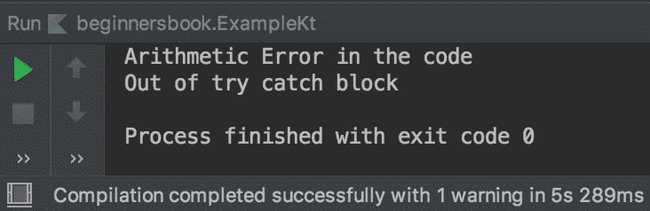

# Kotlin `try-catch`

> 原文： [https://beginnersbook.com/2019/03/kotlin-try-catch/](https://beginnersbook.com/2019/03/kotlin-try-catch/)

在上一个教程中，我们学习了什么是[异常处理](https://beginnersbook.com/2019/03/kotlin-exception-handling/)。在本指南中，我们将看到`try catch`块的各种示例。我们还将看到如何使用`try`作为表达式。

## `try catch`块的语法

```kotlin
try {
    //code where an exception can occur
}
catch (e: SomeException) {
    // handle the exception
}
finally {
    // optional block but executes always
}
```

`try`块可以与多个`catch`块相关联，但是只能存在一个`finally`块。

## Kotlin `try catch`块示例

在这个例子中，我们放置了可能导致`try`块内异常的代码。一旦异常发生在`try`块内，它就会查找处理发生的异常的相应`catch`块。由于在代码中发生了`ArithmeticException`并且在`catch`块中处理了相同的异常，因此执行`catch`块中的代码。

异常处理的主要优点是程序不会突然终止。在以下示例中，最后一个`println`语句`println("Out of try catch block")`在`catch`块之后执行。如果我们没有进行异常处理，则不会执行此语句，因为程序将在行`var num = 100/0`上终止

```kotlin
fun main(args: Array<String>) {
    try{
        var num = 100/0
        println(num)
    }
    catch(e: ArithmeticException){
        println("Arithmetic Error in the code")

    }
    println("Out of try catch block")
}
```

**输出：**



## Kotlin 没有`catch`块的`try`块

`try`块可以没有`catch`块，但在这种情况下必须存在`finally`块。 **总之，你可以说至少应该有一个`catch`或`finally`块**。`finally`块是可选的，但是当没有`catch`块时，必须有一个`finally`块。

```kotlin
fun main(args: Array<String>) {
    try{
        var num = 10/5
        println(num)
    }
    finally{
        println("Finally block")
    }

    println("Out of try catch block")
}
```

**输出：**

```kotlin
2
Finally block
Out of try catch block
```