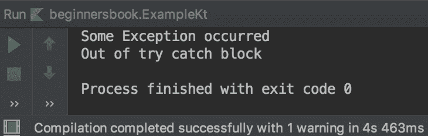
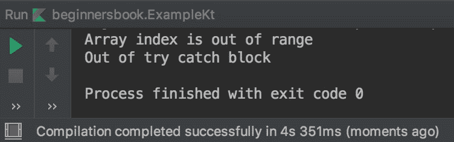
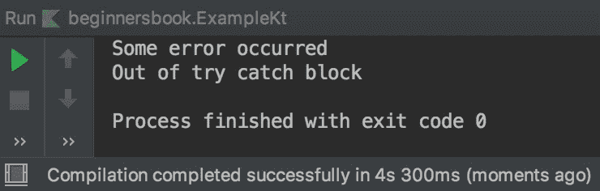

# Kotlin Multiple Catch Blocks 示例

> 原文： [https://beginnersbook.com/2019/03/kotlin-multiple-catch-blocks/](https://beginnersbook.com/2019/03/kotlin-multiple-catch-blocks/)

try 块可以有多个 catch 块。当我们不确定 try 块内是否会发生所有异常时，为潜在的异常设置多个 catch 块总是一个好主意，并且在最后一个 catch 块中有父异常类来处理未指定的剩余异常通过 catch 块。

## Kotlin 多个捕获块的例子

在下面的示例中，我们有多个 catch 块，但是当发生异常时，它会查找该特定异常的处理程序。

这里发生的异常是算术异常，但是前两个 catch 块没有处理算术异常，这就是为什么执行第三个 catch 块的代码。第三个块处理所有异常，因为它使用 Exception 类，它是所有异常类的父类。

```kotlin
fun main(args: Array<String>) {
    try{
        var num = 10/0
        println(num)
    }
    catch(e: NumberFormatException){
        println("Number format exception")
    }
    catch(e: ArrayIndexOutOfBoundsException){
        println("Array index is out of range")
    }
    catch(e: Exception){
        println("Some Exception occurred")
    }

    println("Out of try catch block")
}
```

**输出：**



## 多个 catch 块的另一个例子

下面是多个 catch 块的另一个例子，这里发生了 ArrayIndexOutOfBoundsException，因为这个异常存在一个处理程序（catch 块），执行处理程序内部的代码。

```kotlin
fun main(args: Array<String>) {
    try{
        val a = IntArray(5)
        a[10] = 99
    }
    catch(e: ArithmeticException){
        println("ArithmeticException occurred")
    }
    catch(e: NumberFormatException){
        println("Number format exception")
    }
    catch(e: ArrayIndexOutOfBoundsException){
        println("Array index is out of range")
    }
    catch(e: Exception){
        println("Some error occurred")
    }

    println("Out of try catch block")
}
```

**输出：**



## 为什么在最后一个 catch 块中使用父 Exception 类是个好主意

让我们采用我们上面的相同示例，但在此代码中，我们做了一个小改动。这里我们首先得到父 Exception 类的处理程序（catch 块）。

在代码中发生了 ArrayIndexOutOfBoundsException 并且我们有这个特殊异常的处理程序，但是因为我们首先有一般的 Exception 类，它处理所有异常所以它被执行而不是处理 ArrayIndexOutOfBoundsException 的 catch 块。

以顺序方式检查 catch 块，以便执行第一个 catch 块，实际上在任何异常的情况下，第一个 catch 将执行，这是一个糟糕的编程习惯，因为我们想要一个特定的消息而不是一般化的消息。因此，解决方案是在最后一个位置使用此默认处理程序，就像我们在上面的示例中所做的那样。

```kotlin
fun main(args: Array<String>) {
    try{
        val a = IntArray(5)
        a[10] = 99
    }
    catch(e: Exception){
        println("Some error occurred")
    }
    catch(e: ArithmeticException){
        println("ArithmeticException occurred")
    }
    catch(e: NumberFormatException){
        println("Number format exception")
    }
    catch(e: ArrayIndexOutOfBoundsException){
        println("Array index is out of range")
    }
    println("Out of try catch block")
}
```

**输出：**

