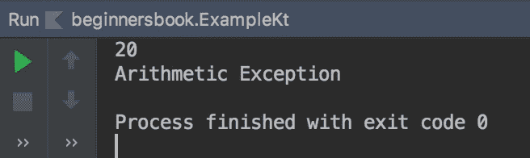

# Kotlin 嵌套`Try-Catch`块

> 原文： [https://beginnersbook.com/2019/03/kotlin-nested-try-catch-block/](https://beginnersbook.com/2019/03/kotlin-nested-try-catch-block/)

当`try catch`块出现在另一个`try catch`块中时，它被称为嵌套的`try catch`块。如果在内部`try catch`块中没有处理内部`try catch`块中发生任何异常，则检查外部`try catch`块的`catch`块是否存在该异常。

## 嵌套`try catch`块的语法

```kotlin
try{
     //code
     try{
           //code
     }
     catch
     {
          //handler
     }
}
catch
{
          //handler
}

```

## 嵌套的`Try-Catch`块示例

在下面的示例中，内部`try`块中存在异常，但是在内部`catch`块中未处理发生的异常（`ArithmeticException`），因此检查外部`catch`块是否存在此异常，因为外部`catch`块正在处理此异常，代码对于`ArithmeticException`，执行外部的`catch`块。

`try`块中可以有多个`try catch`块，内部`try`块内也可以有`try catch`块。这里要注意的唯一事情是，如果在子`try`块中没有处理异常，那么将检查父`try catch`块的处理程序是否发生了异常。

```kotlin
fun main(args: Array<String>) {
    try {
        val num = 100 / 5
        println(num)
        try {
            val num2 = 100 / 0
            println(num2)
        }
        catch(e: NumberFormatException){
            println("Number Format Exception")
        }
    }
    catch(e: ArithmeticException){
        println("Arithmetic Exception")
    }
}
```

**输出：**

