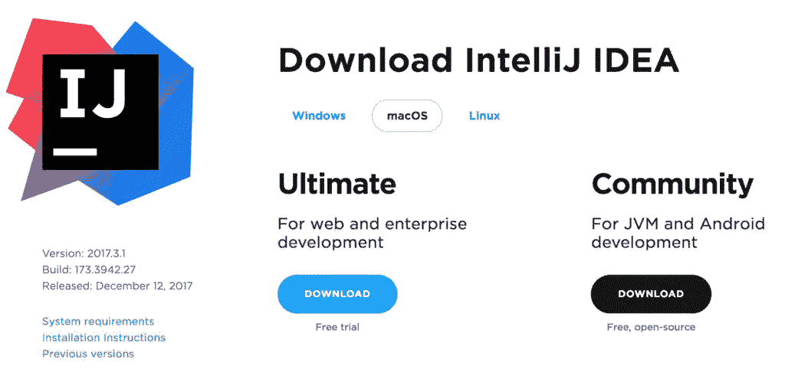
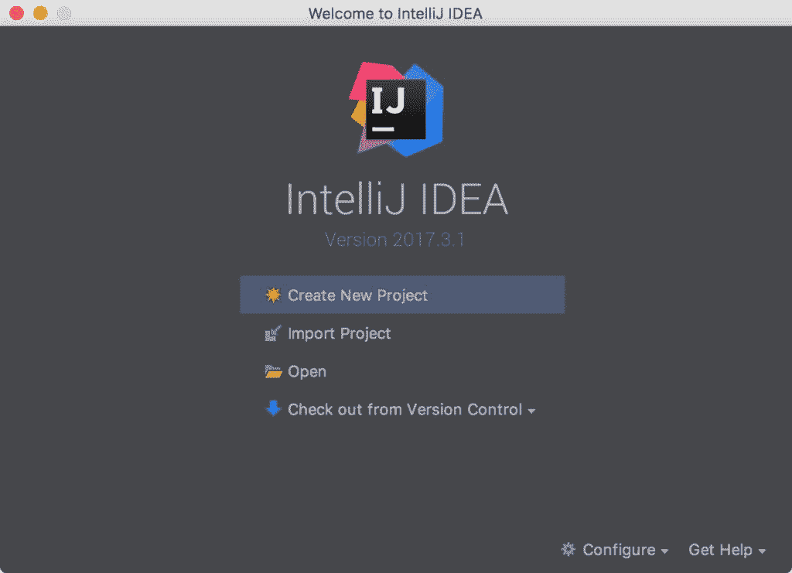
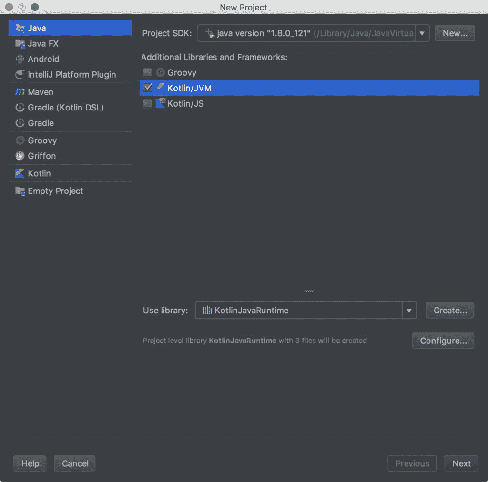
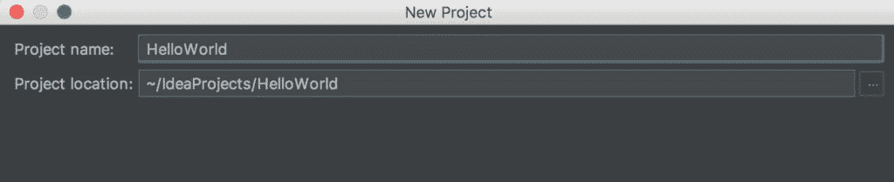
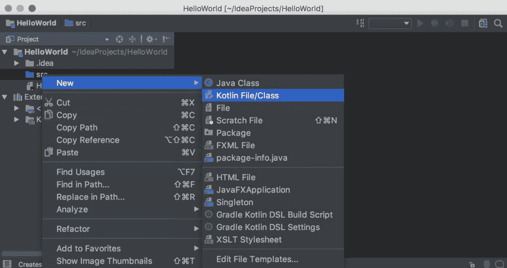
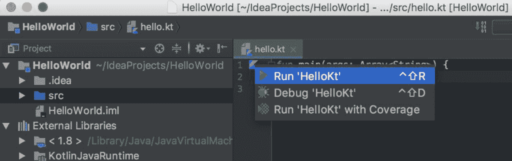
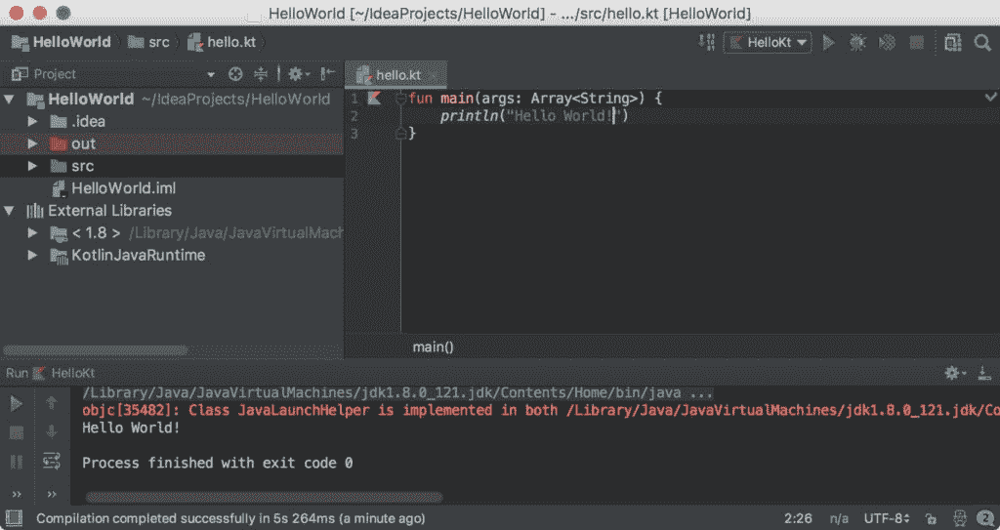

# 在 IntelliJ IDEA 中创建并运行您的第一个 Kotlin 项目

> 原文： [https://beginnersbook.com/2017/12/create-and-run-your-first-kotlin-project-in-intellij-idea/](https://beginnersbook.com/2017/12/create-and-run-your-first-kotlin-project-in-intellij-idea/)

在上一个教程中，我们已经看到[如何在 Eclipse IDE](https://beginnersbook.com/2017/12/kotlin-in-eclipse-ide/) 中创建和运行您的第一个 Kotlin 项目。在本指南中，我们将看到如何安装 **IntelliJ IDEA** ，这是一个由开发 Kotlin 编程语言的 JetBrains 开发的 IDE。我们还将看到如何在 IntelliJ IDEA 中创建和运行**第一个 Kotlin 项目**。

## IntelliJ IDEA 安装

转到官方 Jetbrains 网站的[下载页面](https://www.jetbrains.com/idea/download/)。选择操作系统并下载社区版。

## 在 IntelliJ IDEA IDE 中创建您的第一个 Kotlin 项目

第 1 步：选择“创建新项目”。

步骤 2：在“Additional Libraries and Frameworks”部分中，选择“Kotlin / JVM”并单击“Next”。

第 3 步：提供项目名称，然后单击“完成”。

第 4 步：在 Kotlin 项目的“src”文件夹中创建一个新的 Kotlin 文件。

第 5 步：输入代码

步骤 6：要运行 Kotlin 文件，请单击位于左侧的 **Kotlin 图标**，如下面的屏幕截图所示。选择“Run'HelloKt'”来运行该文件。

第 7 步：如果一切顺利，您应该在屏幕底部看到程序的输出。

