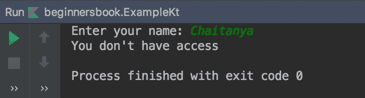

# Kotlin 抛出关键字示例

> 原文： [https://beginnersbook.com/2019/03/kotlin-throw-keyword-with-example/](https://beginnersbook.com/2019/03/kotlin-throw-keyword-with-example/)

在这个简短的指南中，我们将学习如何在 Kotlin 中使用 throw 关键字抛出异常。

## Kotlin throw 关键字示例

在下面的示例中，我们使用 throw 关键字抛出异常。在这里我抛出了父 Exception 类，你可以抛出任何异常，如 ArithmeticException，ArrayIndexOutOfBoundsException 等。

```kotlin
fun main(args: Array<String>) {
    print("Enter your name: ")
    val name = readLine()

    try{
        if (name == "Chaitanya"){
            throw Exception("You don't have access")
        }
        else
        {
            println("Welcome! You have access")
        }
    }
    catch (e: Exception){
        println(e.message)
    }
}
```

**输出：**

