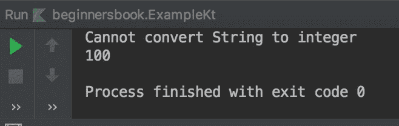

# Kotlin 尝试作为异常处理中的表达式

> 原文： [https://beginnersbook.com/2019/03/kotlin-try-as-an-expression/](https://beginnersbook.com/2019/03/kotlin-try-as-an-expression/)

Kotlin 中的 try 块可以作为表达式使用。它可以像任何其他表达式一样返回一个值，返回的值可以存储在一个变量中。在本指南中，我们将学习如何在 Kotlin 中使用 try 作为表达式。

## Kotlin 尝试作为表达的例子

在以下示例中，try 块用作表达式，try 返回的值可以存储在变量中，如以下示例所示。

```
fun main(args: Array<String>) {
    var website = "Beginnersbook.com"
    var num = try {
        website.toInt()
    }
    catch (e: NumberFormatException)
    {
        "Cannot convert String to integer"
    }
    println(num)

    var number = "100"
    var num2 = try {
        number.toInt()
    }
    catch (e: NumberFormatException)
    {
        "Cannot convert String to integer"
    }
    println(num2)
}
```

**输出：**
