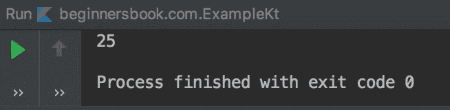

# Kotlin 类和对象 - 面向对象编程（OOP）

> 原文： [https://beginnersbook.com/2019/03/kotlin-class-and-objects-oop/](https://beginnersbook.com/2019/03/kotlin-class-and-objects-oop/)

Kotlin 是一种面向对象的编程语言，就像 [Java](https://beginnersbook.com/2013/04/oops-concepts/) 一样。面向对象编程（OOP）允许我们通过使用对象来解决复杂问题。在本指南中，我们将学习什么是类，什么是对象以及面向对象编程（OOP）的其他几个特性。

## 科特林班

类是任何面向对象编程语言的主要构建块。所有对象都是类的一部分，并分别以数据成员和成员函数的形式共享由类定义的公共属性和行为。

类就像对象的蓝图。

类就像对象的原型，您可以通过对方法和变量进行分组来创建。

### 如何在 Kotlin 中定义一个类

在 Kotlin 中使用`class`关键字定义类。例如 -

```kotlin
class MyClass {
  // variables or data members
  // member functions
  ..
  ..
}
```

### Kotlin 类示例

在下面的例子中，我们有一个类`Example`，在该类中我们有一个数据成员`number`和一个成员函数`calculateSquare()`。数据成员也称为属性和成员函数，作为面向对象编程语言术语中的行为。此类的对象共享这些属性和行为。

```kotlin
class Example {

    // data member
    private var number: Int = 5

    // member function
    fun calculateSquare(): Int {
        return number*number
    }
}
```

我没有在上面的类中指定任何访问修饰符。访问修饰符限制访问。默认情况下，访问修饰符为`public`。在上面的例子中，我们没有指定任何访问修饰符，因此默认情况下`public`访问修饰符适用于上述类`Example`

上述类中的数据成员被指定为`private`，这意味着数据成员`number`在类 Example 之外是不可访问的。

**如何定义访问修饰符？**

访问修饰符在 class 关键字之前指定。

```kotlin
private class MyClass {

}
```

**其他访问修饰符：**

private - 只能在类内访问。
public - 可随处访问。
protected - 可以访问类及其子类。
内部 - 可以在模块内部访问。

## Kotlin 对象

对象使用类的属性和行为。如上所述，类只是一个蓝图，没有为类分配内存。一旦创建了类的对象，它们就会占用内存空间，并使用类的数据成员和成员函数对数据执行各种操作。

### 如何创建类的对象

假设我的类名是`Example`，这个类的对象可以像这样创建：

```kotlin
Example e = Example()

```

注意：这里我将对象命名为`e`，除了 Kotlin 中已定义的关键字外，您可以为对象指定任何名称。这里需要注意的另一点是，与我们使用 new 关键字来创建对象的 java 不同，我们在这里不使用 new 关键字，实际上如果你使用它，你将得到一个编译错误。

### 如何访问数据成员和成员函数

使用对象`e`访问类`Example`的数据成员`number`和成员函数`calculateSquare`。

```kotlin
//Access data member
e.number

//Access member function
e.calculateSquare()

```

让我们举一个完整的例子来理解上面讨论过的概念。

### Kotlin 对象的例子

```kotlin
class Example {

    // data member
    private var number: Int = 5

    // member function
    fun calculateSquare(): Int {
        return number*number
    }
}

fun main(args: Array<String>) {

    // create obj object of Example class
    val obj = Example()
    println("${obj.calculateSquare()}")
}
```

**输出：**

