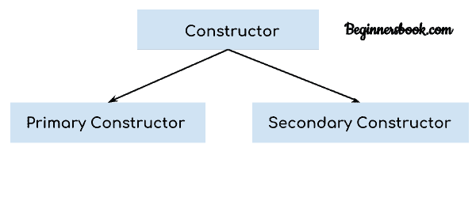
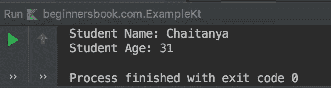
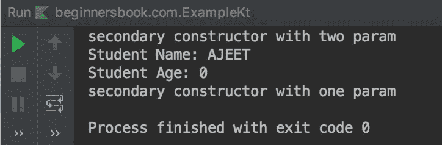

# Kotlin Constructors 的例子

> 原文： [https://beginnersbook.com/2019/03/kotlin-constructors/](https://beginnersbook.com/2019/03/kotlin-constructors/)

构造函数的主要目的是初始化类的属性。在创建类的对象时调用构造函数。在 Kotlin 中，我们有两种类型的构造函数 - 主构造函数和辅助构造函数。在本指南中，我们将通过示例学习主要和次要构造函数，我们还将了解初始化程序块。

## Kotlin 中的构造函数类型


1\. Primary Constructor - 初始化类
的属性 2\. Secondary Constructor - 初始化类的属性，我们可以在辅助构造函数中有额外的初始化代码。

## 1.主要构造函数

主构造函数是初始化类的最简单方法。它被声明为类头的一部分。在下面的示例中，我们将构造函数`(val name: String, var age: Int)`声明为类头的一部分。这是我们的主要构造函数，它初始化类`Student`的`name`和`age`属性（数据成员）。

```
fun main(args: Array<String>) {

    //creating the object of class Student
    val stu = Student("Chaitanya", 31)

    println("Student Name: ${stu.name}")
    println("Student Age: ${stu.age}")
}

class Student(val name: String, var age: Int) {
    //This is my class. For now I am leaving it empty
}
```

**输出：**


## Kotlin 构造函数中的默认值

我们也可以像在下面的例子中那样在 Kotlin 构造函数中指定默认值。在这里，我们将默认学生姓名指定为“学生”，默认学生年龄为 99。

我们创建了这个类的三个对象，一个具有名称和年龄，第二个对象只有名称，第三个对象没有名称和年龄。正如您在输出中所看到的，默认值被创建类的对象时传递的值覆盖。

```
fun main(args: Array<String>) {

    //creating the object of class Student
    val stu = Student("Chaitanya", 31)
    val stu2 = Student("Chaitanya")
    val stu3 = Student()

    println("Name: ${stu.name} and Age: ${stu.age}")
    println("Name: ${stu2.name} and Age: ${stu2.age}")
    println("Name: ${stu3.name} and Age: ${stu3.age}")

}

class Student(val name: String = "Student", var age: Int = 99) {
    //This is my class. For now I am leaving it empty
}
```

**输出：**


## Kotlin 构造函数中的初始化程序块

让我们学习在类的构造函数中有额外的初始化代码。在下面的例子中，我们有一个初始化块，我们在构造函数中使用`init`声明了它。在这个块中，我们可以有额外的初始化逻辑。

```
fun main(args: Array<String>) {

    val stu = Student("Chaitanya", 31)
    val stu2 = Student("Chaitanya")
    val stu3 = Student()

}

class Student(val name: String = "Student", var age: Int = 99) {
    val stuName: String
    var stuAge: Int
    init{
        if(name == "Student") {
            stuName = "NA"
            stuAge = 0
        }
        else {
            stuName = name.toUpperCase()
            stuAge = age
        }
        println("Student Name is: $stuName")
        println("Student Age is: $stuAge")
    }
}
```

**输出：**


## 2\. Kotlin 二级建设者

Kotlin 中的辅助构造函数是使用`constructor`关键字创建的。他们在继承中发挥着重要作用。我建议您在通过辅助构造函数之前先阅读继承主题。

### 辅助构造函数的语法

```
class Student {
    constructor(name: String) {
        // code inside constructor
    }
    constructor(name: String, age: Int) {
        // code inside constructor
    }
}
```

### 辅助构造函数的示例

这是如何在类中声明辅助构造函数的简单示例。

```
fun main(args: Array<String>){
    val obj = Student ("Ajeet", 30)
}

class Student{
    constructor(name: String, age: Int){
        println("Student Name: ${name.toUpperCase()}")
        println("Student Age: $age")
    }
}
```

**输出：**

```
Student Name: AJEET
Student Age: 30
```

### 从另一个调用一个辅助构造函数

在这个例子中，我们有两个辅助构造函数，一个具有一个参数，另一个具有两个参数。我们使用`this`关键字从另一个构造函数调用构造函数。

```
fun main(args: Array<String>){
    val obj = Student ("Ajeet")
}
class Student{
    constructor(name: String): this(name, 0){
        println("secondary constructor with one param")
    }
    constructor(name: String, age: Int){
        println("secondary constructor with two param")
        println("Student Name: ${name.toUpperCase()}")
        println("Student Age: $age")
    }
}
```

**输出：**


### 带有父类和子类的 Kotlin Secondary Constructor 示例

在下面的例子中，我们有两个类`College`，它是父类和子类`Student`。这里子类的辅助构造函数使用`super`关键字调用父类的辅助构造函数。

```
fun main(args: Array<String>){
    val stu = Student("Harry", 24)
}

open class College{

    constructor(name: String, age: Int){
        println("parent class constructor")
        println("Student Name: ${name.toUpperCase()}")
        println("Student Age: $age")
    }
}
class Student: College{
    constructor(name: String, age: Int): super(name,age){
        println("child class constructor")
        println("Student Name: $name")
        println("Student Age: $age")
    }
}
```

**Output:**

```
parent class constructor
Student Name: HARRY
Student Age: 24
child class constructor
Student Name: Harry
Student Age: 24
```