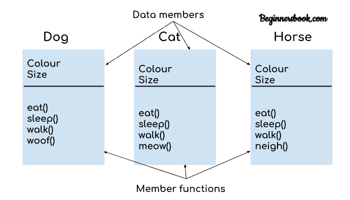
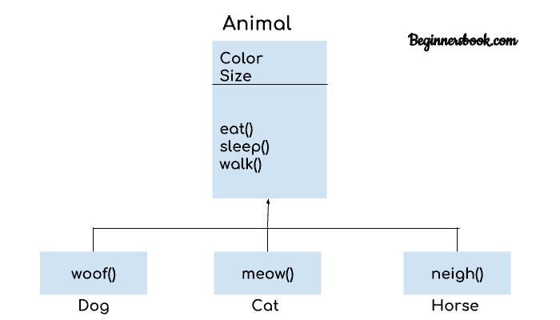
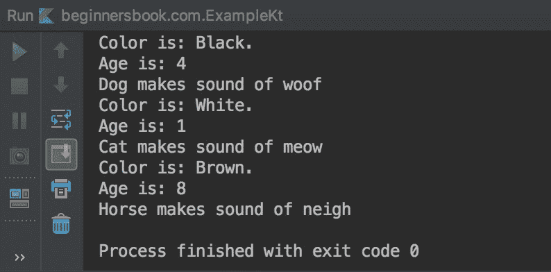

# Kotlin 继承与例子

> 原文： [https://beginnersbook.com/2019/03/kotlin-inheritance/](https://beginnersbook.com/2019/03/kotlin-inheritance/)

**继承**是一个功能，使用该功能继承另一个类的所有功能。从中继承要素的类称为基类或超类或父类，并且继承要素的类称为派生类或子类或子类。在本指南中，我们将借助示例了解什么是继承以及如何在 Kotlin 中实现它。

## 什么是继承以及为什么需要它？

假设我们有三个类`Dog`，`Cat`和`Horse`。所有这三个类都有一些属性（数据成员）和一些行为（成员函数）。我们在下图中描述了这些类的属性和行为。



我们可以在图中看到这三个类具有很少的属性和行为，为什么不创建具有公共属性和行为的泛化类，让这三个类继承该泛化类。此外，除了继承的类之外，这些类可以具有其独特的属性和行为。



所以 Dog 类现在继承了 Animal 类的所有功能，并添加了一个额外的功能 woof（），同样 Cat 类继承了 Animal 类的所有功能，并添加了它的独特功能 meow（）等等。

让我们在 Kotlin 程序中写下这个逻辑。

**注意：**默认情况下，Kotlin 中的所有类都是最终的，所以你必须在父类中使用`open`注释，这告诉编译器这个类可以被其他类继承。

```
open class Animal(colour: String, age: Int) {
    init {
        println("Color is: $colour.")
        println("Age is: $age")
    }
}

class Dog(colour: String, age: Int): Animal(colour, age) {

    fun woof() {
        println("Dog makes sound of woof")
    }
}

class Cat(colour: String, age: Int): Animal(colour, age) {

    fun meow() {
        println("Cat makes sound of meow")
    }
}

class Horse(colour: String, age: Int): Animal(colour, age) {

    fun neigh() {
        println("Horse makes sound of neigh")
    }
}

fun main(args: Array<String>) {
    val d = Dog("Black",4)
    d.woof()
    val c = Cat("White", 1)
    c.meow()
    val h = Horse("Brown", 8)
    h.neigh()
}
```

**输出：**



## 覆盖 Kotlin 中的成员函数和属性

如果子类中存在具有相同名称的函数或属性，则我们需要使用`override`关键字在子类中覆盖它们。

### 覆盖成员函数

子类可以使用 override 关键字覆盖父类的成员函数。通过重写函数，子类为现​​有的基类代码提供自己的实现。覆盖并不意味着它将更新基类中的代码，该更改仅适用于覆盖函数或其子类的类。让我们举个例子。

```
open class Animal() {
    open fun sound() {
        println("Animal makes a sound")
    }
}

class Dog: Animal() {
    override fun sound() {
        println("Dog makes a sound of woof woof")
    }
}

fun main(args: Array<String>) {
    val d = Dog()
    d.sound()
}
```

**输出：**

```
Dog makes a sound of woof woof
```

### 覆盖基类的属性（数据成员）

我们可以覆盖基类的属性，类似于我们在上面看到的成员函数。在下面的示例中，我们在父类中有一个属性颜色，我们在子类中重写它。

```
open class Animal() {
    open var colour: String = "White"
}

class Dog: Animal() {
    override var colour: String = "Black"
    fun sound() {
        println("Dog makes a sound of woof woof")
    }
}

fun main(args: Array<String>) {
    val d = Dog()
    d.sound()
    println("${d.colour}")
}
```

**输出：**

```
Dog makes a sound of woof woof
Black
```

## 从子类调用基类的数据成员和成员函数

在下面的示例中，我们使用`super`关键字从 Child 类调用父类的数据成员`num`和成员函数`demo()`。

```
open class Parent() {
    open var num: Int = 100
    open fun demo(){
        println("demo function of parent class")
    }
}

class Child: Parent() {
    override var num: Int  = 101
    override fun demo() {
        super.demo()
        println("demo function of child class")
    }
    fun demo2(){
        println(super.num)
    }
}

fun main(args: Array<String>) {
    val obj = Child()
    obj.demo()
    obj.demo2()
}
```

**输出：**

```
demo function of parent class
demo function of child class
100
```