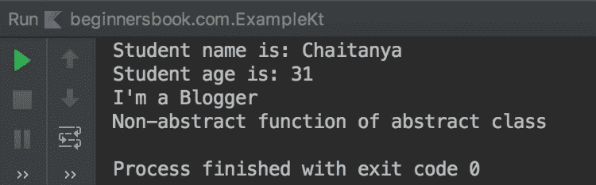

# Kotlin 抽象类与示例

> 原文： [https://beginnersbook.com/2019/03/kotlin-abstract-class/](https://beginnersbook.com/2019/03/kotlin-abstract-class/)

抽象类无法实例化，这意味着我们无法创建抽象类的对象。与其他类不同，抽象类总是打开的，因此我们不需要使用`open`关键字。

**注意事项：**

1.  我们无法创建抽象类的对象。
2.  抽象类的属性和成员函数默认为**非抽象**。如果要在子类中覆盖这些，则需要为它们使用`open`关键字。
3.  如果成员函数是抽象的，那么它必须在子类中实现。抽象成员函数没有仅主体方法签名，实现在子类中完成。

## 抽象类示例

在下面的例子中我们有一个抽象类`Student`，我们不能创建这个类的对象。但是我们可以继承这个类，就像我们在下面的例子中所做的那样。类`College`继承抽象类`Student`。

函数`func()`是一个抽象函数，这意味着它没有正文和唯一的方法签名，但由于它是一个抽象函数，它必须是子类中的[覆盖](https://beginnersbook.com/2019/03/kotlin-visibility-modifiers/)。

```kotlin
abstract class Student(name: String, age: Int) {

    init {
        println("Student name is: $name")
        println("Student age is: $age")
    }

    //non-abstract function
    fun demo() {
        println("Non-abstract function of abstract class")
    }

    //abstract function
    abstract fun func(message: String)
}

class College(name: String, age: Int): Student(name, age) {

    override fun func(message: String) {
        println(message)
    }
}

fun main(args: Array<String>) {
    val obj = College("Chaitanya", 31)
    obj.func("I'm a Blogger")
    obj.demo()
}
```

**输出：**

