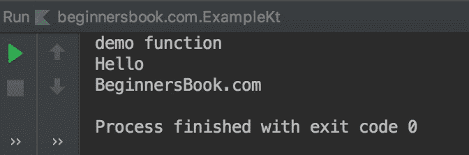
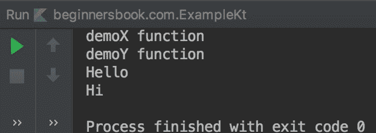

# Kotlin 接口与示例

> 原文： [https://beginnersbook.com/2019/03/kotlin-interfaces/](https://beginnersbook.com/2019/03/kotlin-interfaces/)

在本指南中，我们将了解接口。与抽象类类似，无法实例化接口，因为它没有任何构造函数。

**注意事项：**

1.  接口可以同时具有抽象和非抽象功能。
2.  接口只能有抽象属性（数据成员），不允许非抽象属性。
3.  一个类可以实现多个接口。
4.  接口的所有抽象属性和抽象成员函数必须在实现它的类中重写。

## Kotlin 接口示例

在下面的例子中，我们有一个接口`MyInterface`，它包含一个非抽象方法`func`和抽象属性`str`&amp;抽象函数`demo`。

```kotlin
interface MyInterface{
    var str: String

    fun demo()

    fun func(){
        println("Hello")
    }
}

class MyClass: MyInterface{
    override var str: String = "BeginnersBook.com"
    override fun demo() {
        println("demo function")
    }
}
fun main(args: Array<String>) {
    val obj = MyClass()
    obj.demo()
    obj.func()
    println(obj.str)

}
```

**输出：**



## Kotlin - 实现多个接口

在以下示例中，我们有两个接口`X`和`Y`。类`MyClass`实现了接口 X 和 Y.该类为接口 X 和 Y 的抽象方法提供了实现。

```kotlin
interface X {

    fun demoX() {
        println("demoX function")
    }
    fun funcX()
}

interface Y  {
    fun demoY() {
        println("demoY function")
    }
    fun funcY()
}

// This class implements X and Y interfaces
class MyClass: X, Y {
    override fun funcX() {
        println("Hello")
    }
    override fun funcY() {
        println("Hi")
    }

}

fun main(args: Array<String>) {
    val obj = MyClass()
    obj.demoX()
    obj.demoY()
    obj.funcX()
    obj.funcY()
}
```

**输出：**



## 当多个接口具有相同的方法名称时

在下面的例子中，我们有两个接口`X`和`Y`，但这两个接口都具有相同的功能`demo()`。类`MyClass`实现了这两个接口，现在当我们尝试使用类的对象调用这个函数 demo（）时，我们将得到编译错误，因为编译器混淆了调用哪个方法。

```kotlin
interface X {

    fun demo() {
        println("demoX function")
    }
}

interface Y  {
    fun demo() {
        println("demoY function")
    }
}

// This class implements X and Y interfaces
class MyClass: X, Y

fun main(args: Array<String>) {
    val obj = MyClass()
    obj.demo()
}
```

### 如何解决相同方法名称的冲突

为了解决上述冲突，我们覆盖了类中的方法，该方法之前导致了冲突。在 overriden 方法中，我们使用`super`关键字确切地指定了要调用的方法。在下面的例子中，我们想调用接口 Y 的 demo（）方法，因此我们在 overriden 方法中指定了`super&lt;Y&gt;.demo()`。

```kotlin

interface X {

    fun demo() {
        println("demoX function")
    }
}

interface Y  {
    fun demo() {
        println("demoY function")
    }
}

// This class implements X and Y interfaces
class MyClass: X, Y{
    override fun demo() {
        super<Y>.demo()
    }
}

fun main(args: Array<String>) {
    val obj = MyClass()
    obj.demo()
}
```

**输出：**

```kotlin
demoY function
```