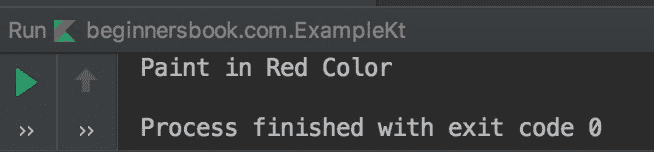

# Kotlin 密封类与实例

> 原文： [https://beginnersbook.com/2019/03/kotlin-sealed-class/](https://beginnersbook.com/2019/03/kotlin-sealed-class/)

**密封类**用于表示受限类层次结构，其中对象或值可以具有来自有限值集合的类型之一。您可以将密封类视为枚举类的扩展。枚举类中的值集也受到限制，但枚举常量只能有单个实例，而密封类的子类可以有多个实例。

## 为什么我们需要密封课程？

让我们首先了解密封课程的必要性。在下面的例子中，我们有一个类`Color`，它有三个子类`Red`，`Orange`和`Blue`。
这里的[当 eval（）方法中的表达式](https://beginnersbook.com/2019/02/kotlin-when-expression/)必须使用 else 分支时，我们会得到一个编译错误。现在，如果我们尝试向类`Color`添加子类，则 else 分支中的代码将执行，这是默认代码。编译器应警告我们新添加的子类的代码不存在，因此我们应该在添加新子类时收到警告或错误，而不在表达式中添加逻辑。使用 Sealed 类解决了这个问题。

```
open class Color{
    class Red : Color()
    class Orange : Color()
    class Blue : Color()
}
fun eval(c: Color) =
        when (c) {
            is Color.Red -> println("Paint in Red Color")
            is Color.Orange -> println("Paint in Orange Color")
            is Color.Blue -> println("Paint in Blue Color")
            else -> println("Paint in any Color")
        }

fun main(args: Array<String>) {
    val r = Color.Red()
    eval(r)
}
```

## Kotlin 密封类示例

在 Kotlin 中，在类标题中的 class 关键字之前使用`sealed`关键字声明了密封类。

让我们使用密封类在上面看到的相同示例。这里我们通过将类`Color`标记为密封来解决上述问题。

名称密封的类仅表示从一组有限的值中获取值。这里 **else 分支在表达式**中不是必需的，因为编译器知道该类是密封的，它只需要三个派生类的表达式，不需要默认的 else 分支。现在，如果我们尝试将新的子类添加到类`Color`中，它将不会创建不必要的错误，而是会引发错误。

例如，如果我们在密封类`Color`中添加一个新的子类 White，并且在表达式时不添加 White 子类的表达式，那么我们将得到此错误 - `Error:(12, 9) Kotlin: 'when' expression must be exhaustive, add necessary 'is White' branch or 'else' branch instead`

```
sealed class Color{
    class Red : Color()
    class Orange : Color()
    class Blue : Color()
}
fun eval(c: Color) =
        when (c) {
            is Color.Red -> println("Paint in Red Color")
            is Color.Orange -> println("Paint in Orange Color")
            is Color.Blue -> println("Paint in Blue Color")
        }

fun main(args: Array<String>) {
    val r = Color.Red()
    eval(r)
}
```

**输出：**


现在你可以理解，通过使类密封，我们将限制添加到类层次结构中。

## Kotlin 的密封课程规则

1.我们无法创建密封类的对象，这意味着密封类无法实例化。
2.密封类的所有子类必须在声明密封类的同一文件中声明。
3.密封类的构造函数默认为 private，我们不能将其设为非私有。