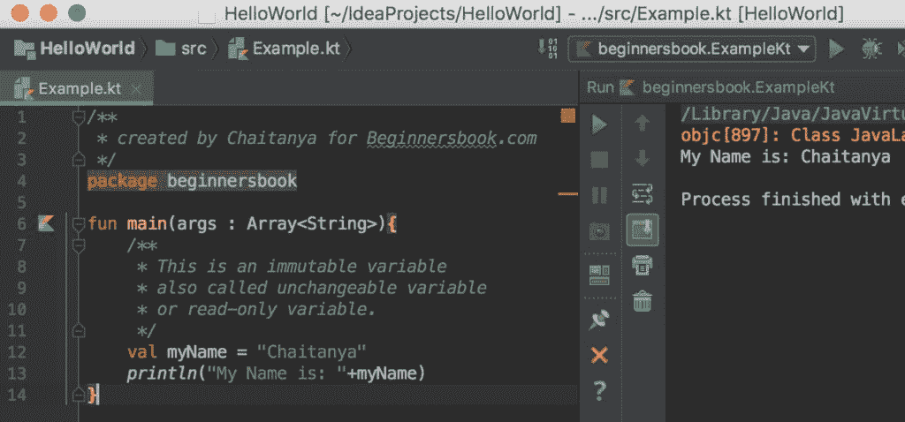
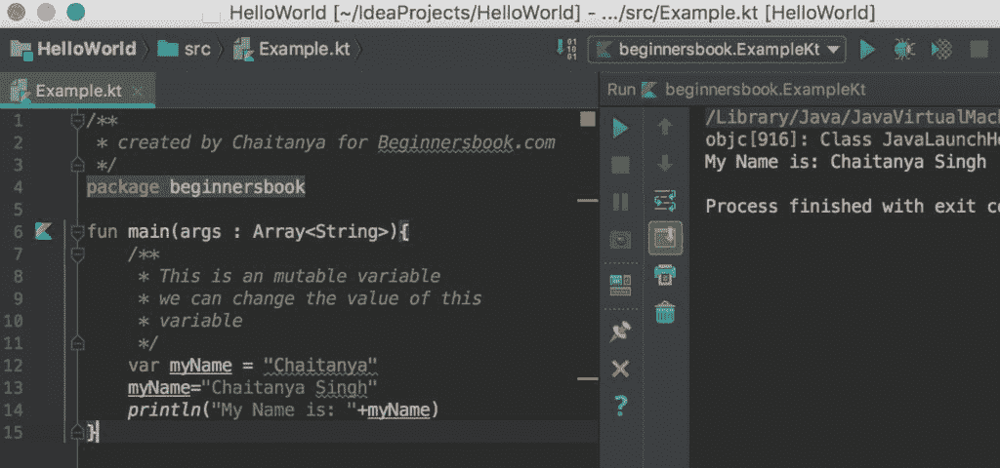
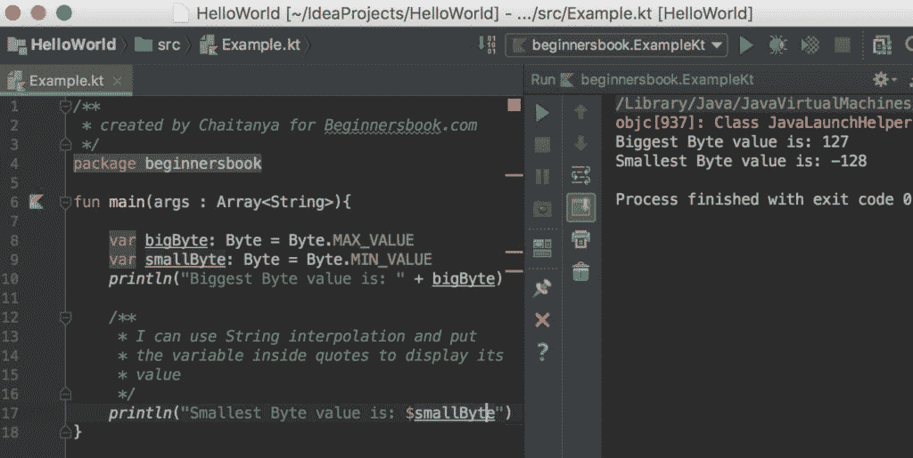

# Kotlin 变量和数据类型

> 原文： [https://beginnersbook.com/2017/12/kotlin-variables-data-types/](https://beginnersbook.com/2017/12/kotlin-variables-data-types/)

有两种类型的变量 - 可变和不可变。不可变变量是不能更改其值的变量，也称为不可变或只读变量。另一方面，可变变量的值可以改变。

## 不可变变量：val 关键字

在 Kotlin 中使用`val`关键字声明不可变变量。在这个例子中，我们使用`val`关键字声明了一个不可变变量`myName`，后来显示了它的值。

```
/**
 * created by Chaitanya for Beginnersbook.com
 */
package beginnersbook

fun main(args : Array<String>){
    /**
     * This is an immutable variable
     * also called unchangeable variable
     * or read-only variable.
     */
    val myName = "Chaitanya"
    println("My Name is: "+myName)
}
```

**输出：**



**当我们尝试更改不可变变量的值时会发生什么？**

如果我们尝试更改不可变变量的值，我们将得到一个编译错误，就像我们在下面的例子中得到的那样。

```
/**
 * created by Chaitanya for Beginnersbook.com
 */
package beginnersbook

fun main(args : Array<String>){
    /**
     * This is an immutable variable
     * also called unchangeable variable
     * or read-only variable.
     */
    val myName = "Chaitanya"
    myName="Chaitanya Singh"
    println("My Name is: "+myName)
}
```

**输出：**

```
Error:(13, 5) Kotlin: Val cannot be reassigned
```

## 可变变量：var 关键字

与不可变变量不同，我们可以更改可变变量的值。在 kotlin 中，我们使用 var 关键字来声明一个可变变量。让我们举一个例子来理解这一点。

在这个例子中，我们使用`var`关键字声明了一个可变变量，为了证明我们可以改变它的值，我们已经为`myName`变量重新分配了一个不同的值。

```
/**
 * created by Chaitanya for Beginnersbook.com
 */
package beginnersbook

fun main(args : Array<String>){
    /**
     * This is an mutable variable
     * we can change the value of this
     * variable
     */
    var myName = "Chaitanya"
    myName="Chaitanya Singh"
    println("My Name is: "+myName)
}
```

**输出：**



## 什么是变量？

变量是一个名称，赋予内存中可以保存数据的位置。例如，当我声明这样的变量时：

```
var website = "beginnersbook"
```

数据“beginnersbook”存储在特定位置的存储器中，称为网站。

这里 var 是一个用于声明变量的关键字，website 是一个标识符（变量的名称），“beginnersbook”是数据（变量的值），变量的类型是 String（我们稍后会讨论） 。

**另请阅读：** [Kotlin 关键字和标识符](https://beginnersbook.com/2017/12/kotlin-keywords-identifiers/)。

## 类型推断

正如我们前面提到的，我们可以在单个语句中声明和初始化变量，如下所示：

```
var website = "beginnersbook"
```

在上面的语句中我们没有指定变量的类型，kotlin 知道变量`website`是一个字符串。编译器可以通过查看值来了解变量的类型。

但是，如果您想明确提及变量的类型，那么您可以这样做：

```
var website: String = "beginnersbook"
```

这里我们已经明确地将变量“website”的类型称为 String。

**首先声明并稍后初始化：**

我们可以先声明变量，然后我们可以在程序中稍后初始化它。这里要注意的重点是，我们这样做，你必须在声明期间指定变量的类型。

```
//It is mandatory to specify the type in this case
var website: String
website = "beginnersbook"
```

## Kotlin 数据类型

1.  数字 - 字节，短，Int，长，浮点，双
2.  布尔 - 真，假
3.  字符
4.  数组
5.  字符串

## 数字

我们有几种数据类型来表示 Kotlin 中的数字。

### 1.字节

字节数据类型的范围是-128 到 127.这用于表示较小的整数值。

```
fun main(args : Array) {
    val num: Byte = 99
    println("$num")
}
```

输出：

```
99
```

您必须了解数据类型的范围以避免错误。例如，以下代码将生成错误，因为分配给 byte 类型的变量的值不在该范围内。

```
fun main(args : Array) {
    //Range is -128 to 127
    val num: Byte = 300
    println("$num")
}
```

输出：
错误

我们也可以知道数据类型的最小值和最大值，如下所示：

```
/**
 * created by Chaitanya for Beginnersbook.com
 */
package beginnersbook

fun main(args : Array<String>){

    var bigByte: Byte = Byte.MAX_VALUE
    var smallByte: Byte = Byte.MIN_VALUE
    println("Biggest Byte value is: " + bigByte)

    /**
     * I can use String interpolation and put
     * the variable inside quotes to display its
     * value
     */
    println("Smallest Byte value is: $smallByte")
}
```

**输出：**



### 2.简短

短数据类型的范围是-32768 到 32767。

```
fun main(args : Array) {
    val num: Short = 29999
    println("$num")
}
```

Output:

```
29999
```

> 您可能想知道我们何时在 Short 数据类型中有更大的范围，为什么我们使用 Byte 数据类型？
> 这是为了节省内存。与字节数据类型相比，短数据类型保留更多内存，因此如果您确定该值将在-128 到 127 的限制内，则从内存角度来看，字节数据类型将是更好的选择

### 国际

Int 数据类型的范围是-2 &lt;sup&gt;31&lt;/sup&gt; 到 2 &lt;sup&gt;31&lt;/sup&gt; -1

```
fun main(args : Array) {
    val num: Int = 123456
    println("$num")
}
```

Output:

```
123456
```

**注意：**如果你没有明确指定变量的类型，那么编译器会将该变量视为 Int，如果值介于-2 &lt;sup&gt;31&lt;/sup&gt; 到 2 &lt;sup&gt;31&lt;/sup&gt; -1

### 很久了

Long 数据类型的范围是-2 &lt;sup&gt;63&lt;/sup&gt; 到 2 &lt;sup&gt;63&lt;/sup&gt; -1

```
fun main(args : Array) {
    val num: Long = 12345678
    println("$num")
}
```

Output:

```
12345678
```

**注意：**如果没有明确指定变量的类型，那么编译器会将该变量视为 Long，如果该值超出-2 &lt;sup&gt;31&lt;/sup&gt; 到 2 的范围 &lt;sup&gt;31&lt;/sup&gt; -1 但位于-2 &lt;sup&gt;63&lt;/sup&gt; 至 2 &lt;sup&gt;63&lt;/sup&gt; -1 的范围内

### 5.加倍

```
fun main(args : Array) {
    // all floating numbers are double by default
    // unless you suffix the value with F letter
    val num = 101.99
    println("$num")
}
```

Output:

```
101.99
```

### 6.漂浮

```
fun main(args : Array) {
    // This is a float data type as we have suffixed
    // the value with letter 'F'
    val num = 101.99F
    println("$num")
}
```

Output:

```
101.99
```

## 布尔

布尔变量的值为 true 或 false。

```
fun main(args : Array) {
    val boolValue = false
    println("$boolValue")
}
```

Output:

```
false
```

## 烧焦

所有英文字母（小写或大写）都包含在 Char 数据类型中。您不能将数字分配给 Char 数据类型的变量。

```
fun main(args : Array) {
    val ch = 'A'
    println("$ch")

    val ch2: Char
    ch2 = 'Z'
    println("$ch2")
}
```

Output:

```
A
Z
```