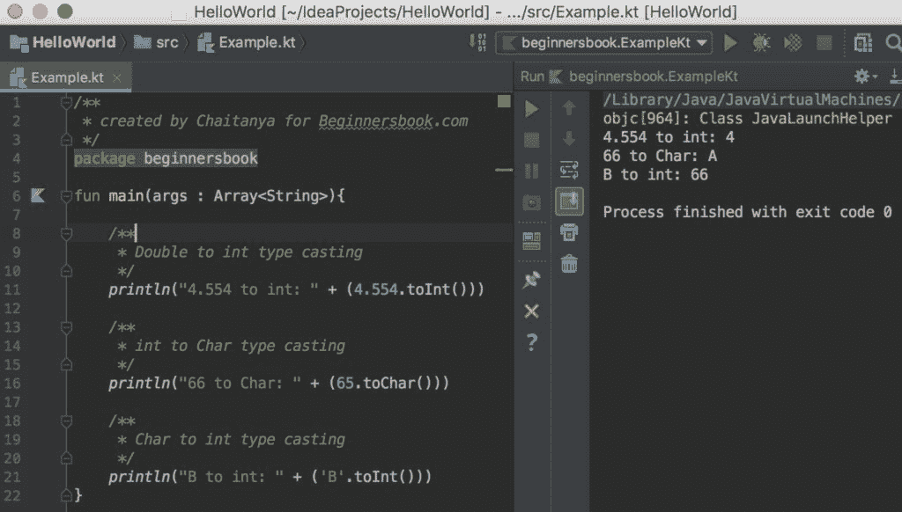

# Kotlin 型铸造用例子

> 原文： [https://beginnersbook.com/2018/09/kotlin-type-conversion/](https://beginnersbook.com/2018/09/kotlin-type-conversion/)

**类型转换**是将一种数据类型转换为另一种类型的过程，例如 - 将 int 转换为 long，long 转换为 double 等。在[教程](https://beginnersbook.com/2017/12/kotlin-tutorial/)中，我们将学习如何操作 **]在 Kotlin 中的类型转换**。

## 在 Kotlin 和 Java 中进行类型转换

在 java 中，一种类型会自动转换为其他类型（在某些情况下），在 Kotlin 中我们需要显式转换类型。

**例如：**
**Java：**
Int 自动转换为 Long 数据类型，因为 long 大于 int。

```
// This code is valid in Java, even though we are converting int to long
// because long is larger than int and it can hold integers
int num1 = 101;
long num2 = num1; 

```

**Kotlin：**
在 Kotlin 中转换不是自动的，我们需要明确地进行类型转换。

```
// This code is invalid in Kotlin. This will cause compile time 
// error, type mismatch
val num1: Int = 101
val num2: Long = num1
```

Kotlin 中的正确代码：
我们使用 toLong（）函数在 Kotlin 中将 int 转换为 long。

```
val num1: Int = 101
val num2: Long = num1.toLong()
```

## 更多 Kotlin 中的类型转换函数

在上面的例子中，我们已经看到我们如何使用`toLong()`函数将整数转换为 Long 类型。同样，我们在 Kotlin 中有其他功能可以帮助我们进行类型转换。

1\. **toChar（）** - 将类型转换为`Char`类型。
2\. **toInt（）** - 将类型转换为`Int`类型。
3\. **toLong（）** - 将类型转换为`Long`类型。
4\. **toFloat（）** - 将类型转换为`Float`类型。
5\. **toDouble（）** - 将类型转换为`Double`类型。
6\. **toByte（）** - 将类型转换为`Byte`类型。
7\. **toShort（）** - 将类型转换为`Short`类型。

## 简单类型铸造实例

```
/**
 * created by Chaitanya for Beginnersbook.com
 */
package beginnersbook

fun main(args : Array<String>){

    /**
     * Double to int type casting
     */
    println("4.554 to int: " + (4.554.toInt()))

    /**
     * int to Char type casting
     */
    println("66 to Char: " + (65.toChar()))

    /**
     * Char to int type casting
     */
    println("B to int: " + ('B'.toInt()))
}
```

**输出：**


## 当我们将较大的类型转换为较小的类型时会发生什么？

将较大类型转换为较小类型时，我们有两种可能的结果。如果我们转换为较小类型的值超出目标类型的范围，则结果将被截断。但是，当值在目标类型的范围内时，它将被转换而不会被截断。

### 示例 1：当值超出目标类型的范围时

在这个例子中，我们将 long 类型转换为 int 类型，其中 long 类型的值超出整数类型的范围。

```
fun main(args : Array<String>) {
    val num1: Long = 5453448989999998988
    val num2: Int = num1.toInt()
    println("Number num1 is: $num1")
    println("Number num2 is: $num2")
}
```

输出：

```
Number num1 is: 5453448989999998988
Number num2 is: 2041161740
```

### 示例 2：当值在目标类型的范围内时

在这个例子中，我们将 long 类型转换为 int 类型，其中 long 类型的值在整数类型的范围内。

```
fun main(args : Array<String>) {
    val num1: Long = 5453448
    val num2: Int = num1.toInt()
    println("Number num1 is: $num1")
    println("Number num2 is: $num2")
}
```

Output:

```
Number num1 is: 5453448
Number num2 is: 5453448
```