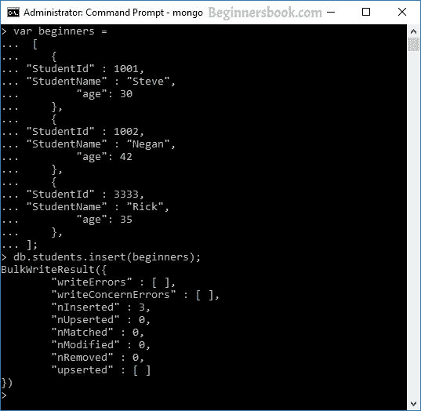
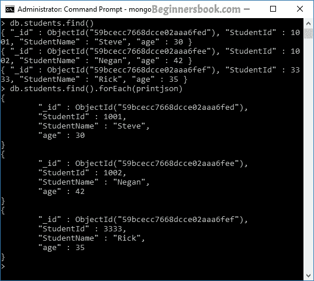

# MongoDB 插入文档

> 原文： [https://beginnersbook.com/2017/09/mongodb-insert-document/](https://beginnersbook.com/2017/09/mongodb-insert-document/)

在本教程中，我们将了解如何将文档插入集合中。我们将在多个示例的帮助下理解这一点。

**将文档插入集合的语法：**

```
db.collection_name.insert()
```

让我们举一个例子来理解这一点。

## MongoDB 使用 insert（）示例插入文档

这里我们将文档插入名为“beginnersbook”的集合中。下面示例中的字段“course”是一个包含多个键值对的数组。

```
db.beginnersbook.insert(  
   {  
     name: "Chaitanya",  
     age: 30,
     email: "[email protected]",
     course: [ { name: "MongoDB", duration: 7 }, { name: "Java", duration: 30 } ]
   }  
)
```

您应该看到一条成功的写消息，如下所示：

```
WriteResult({ "nInserted" : 1 })
```

> 如果集合不存在，则 insert（）方法创建集合，但如果集合存在，则将文档插入其中


**验证：**
您还可以通过键入以下命令验证文档是否已成功插入：

```
db.collection_name.find()
```

在上面的示例中，我们将文档插入名为“beginnersbook”的集合中，因此命令应为：

```
> db.beginnersbook.find()
{ "_id" : ObjectId("59bce797668dcce02aaa6fec"), "name" : "Chaitanya", "age" : 30, 
"email" : "[email protected]", "course" : [ { "name" : "MongoDB", 
"duration" : 7 }, { "name" : "Java", "duration" : 30 } ] }
```

## MongoDB 示例：在集合中插入多个文档

要在集合中插入多个文档，我们定义一个文档数组，稍后我们在数组变量上使用 insert（）方法，如下例所示。这里我们在名为“students”的集合中插入三个文档。此命令将在“学生”集合中插入数据，如果集合不存在，则它将创建集合并插入这些文档。

```
var beginners =
 [
    {
	"StudentId" : 1001,
	"StudentName" : "Steve",
        "age": 30
    },
    {
	"StudentId" : 1002,
	"StudentName" : "Negan",
        "age": 42
    },
    {
	"StudentId" : 3333,
	"StudentName" : "Rick",
        "age": 35
    },
];
db.students.insert(beginners);
```

你会看到这个输出：

```
BulkWriteResult({
        "writeErrors" : [ ],
        "writeConcernErrors" : [ ],
        "nInserted" : 3,
        "nUpserted" : 0,
        "nMatched" : 0,
        "nModified" : 0,
        "nRemoved" : 0,
        "upserted" : [ ]
})
```

如您所见，它在 **nInserted** 前面显示数字 3。这意味着此命令已插入 3 个文档。


验证文档是否在集合中。运行此命令：

```
db.students.find()
```

> **你知道吗？** 您可以以 JSON 格式打印输出数据，以便您可以轻松阅读。要以 JSON 格式打印数据，请运行命令 **db.collection_name.find（）。forEach（printjson）**

所以在我们的例子中命令是这样的：

```
db.students.find().forEach(printjson)
```

在下面的屏幕截图中，您可以看到差异。首先，我们使用普通的 find（）方法打印文档，然后使用 JSON 格式打印相同集合的文档。 JSON 格式的文档简洁易读。

我们还可以使用 MongoDB 2.6 中引入的 New Bulk API 插入多个文档。我们将在 Bulk API 教程中了解到这一点。