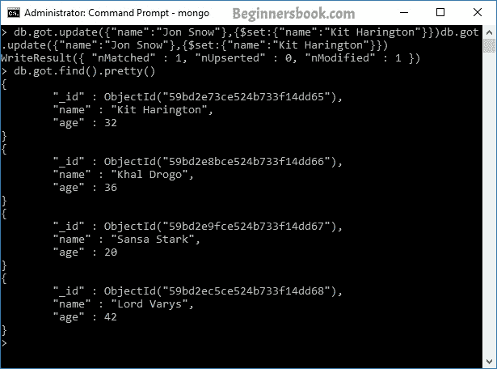
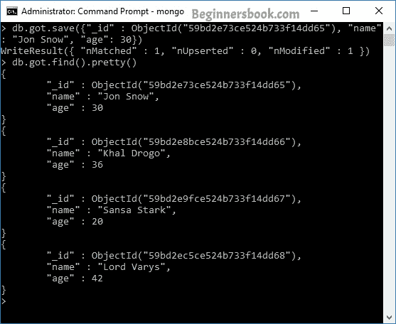

# MongoDB - 更新集合中的文档

> 原文： [https://beginnersbook.com/2017/09/mongodb-update-document/](https://beginnersbook.com/2017/09/mongodb-update-document/)

在 MongoDB 中，我们有两种方法来更新集合中的文档。 1）update（）方法 2）save（）方法。虽然这两种方法都更新了现有文档，但它们正在不同的场景中使用。当我们需要更新现有文档的值时使用 update（）方法，而 save（）方法用于将现有文档替换为已在其中传递的文档。

要更新 MongoDB 中的文档，我们在命令中提供条件，并更新与该条件匹配的文档。要了解标准在 MongoDB 命令中的工作方式，请参阅上一个教程： [MongoDB 查询文档](https://beginnersbook.com/2017/09/mongodb-query-document-using-find-method/)

## 使用 update（）方法更新文档

**语法：**

```js
db.collection_name.update(criteria, update_data)
```

**示例：**

例如：假设我在数据库“beginnersbookdb”中有一个名为“got”的集合。 “得到”里面的文件是：

```js
> db.got.find().pretty()
{
        "_id" : ObjectId("59bd2e73ce524b733f14dd65"),
        "name" : "Jon Snow",
        "age" : 32
}
{
        "_id" : ObjectId("59bd2e8bce524b733f14dd66"),
        "name" : "Khal Drogo",
        "age" : 36
}
{
        "_id" : ObjectId("59bd2e9fce524b733f14dd67"),
        "name" : "Sansa Stark",
        "age" : 20
}
{
        "_id" : ObjectId("59bd2ec5ce524b733f14dd68"),
        "name" : "Lord Varys",
        "age" : 42
}
```

现在假设我想更新名为“Kit Harington”的 Jon Snow 的名字。对此的命令是：

```js
db.got.update({"name":"Jon Snow"},{$set:{"name":"Kit Harington"}})
```

**输出：**



如您所见，该文档已更新。

> **你知道吗？** 默认情况下，更新方法更新单个文档。在上面的示例中，我们只有一个文档与条件匹配，但是如果有更多文档，那么也只会更新一个文档。要启用 update（）方法来更新多个文档，您必须将此方法的“multi”参数设置为 true，如下所示。

**使用 update（）方法更新多个文档：**

```js
db.got.update({"name":"Jon Snow"},
 {$set:{"name":"Kit Harington"}},{multi:true})

```

## 使用 save（）方法更新文档

**语法：**

```js
db.collection_name.save( {_id:ObjectId(), new_document} )
```

让我们采用我们在上面看到的相同的例子。现在我们要将“Kit Harington”的名称更新为“Jon Snow”。要使用 save（）方法，您应该知道该文档的唯一 _id 字段。

> 一个非常重要的**注意事项**是当你在使用 save（）
> 方法时不提供 **_id** 字段时，它调用 insert（）方法并插入传递的文件作为新文档进入集合

要获取文档的 _id，可以键入以下命令：

```js
db.got.find().pretty()
```

这里有一个集合名称。这种查找唯一 _id 的方法仅在您拥有少量文档时才有用，否则在大量文档中滚动和搜索该 _id 是很繁琐的。

如果您有大量文档，那么要获取特定文档的 _id，请使用 find（）方法中的条件。例如：要使用 save（）方法获取要更新的文档的 _id，请键入以下命令：

```js
> db.got.find({"name": "Kit Harington"}).pretty()
{
        "_id" : ObjectId("59bd2e73ce524b733f14dd65"),
        "name" : "Kit Harington",
        "age" : 32
}
```

现在我们知道该文档的唯一 _id 字段。让我们使用 save（）方法编写命令。

```js
> db.got.save({"_id" : ObjectId("59bd2e73ce524b733f14dd65"), "name":
 "Jon Snow", "age": 30})
>
```

你应该看到这个输出：

```js
WriteResult({ "nMatched" : 1, "nUpserted" : 0, "nModified" : 1 })
```

**验证更新：**

