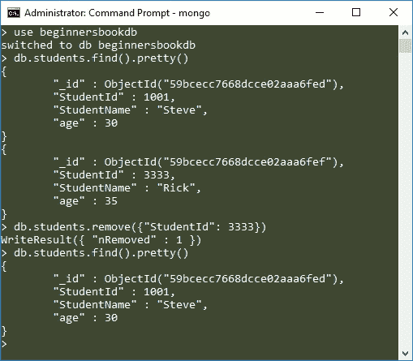
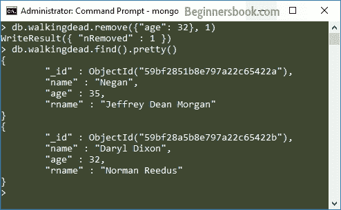

# MongoDB 从集合中删除文档

> 原文： [https://beginnersbook.com/2017/09/mongodb-delete-document/](https://beginnersbook.com/2017/09/mongodb-delete-document/)

在本教程中，我们将学习如何从集合中删除文档。 remove（）方法用于从 MongoDB 中的集合中删除文档。

**remove（）方法的语法：**

```js
db.collection_name.remove(delete_criteria)
```

> 要了解如何在 MongoDB 命令中指定条件，请参阅本教程： [MongoDB 查询文档](https://beginnersbook.com/2017/09/mongodb-query-document-using-find-method/)。

## 使用 remove（）方法删除文档

假设我的 MongoDB 数据库中有一个名为`beginnersbookdb`的集合`students`。 `students`集合中的文件是：

```js
> db.students.find().pretty()
{
        "_id" : ObjectId("59bcecc7668dcce02aaa6fed"),
        "StudentId" : 1001,
        "StudentName" : "Steve",
        "age" : 30
}
{
        "_id" : ObjectId("59bcecc7668dcce02aaa6fef"),
        "StudentId" : 3333,
        "StudentName" : "Rick",
        "age" : 35
}
```

现在我想删除这个学生 ID 等于 3333 的学生。要做到这一点，我会使用 remove（）方法编写一个命令，如下所示：

```js
db.students.remove({"StudentId": 3333})
```

输出：

```js
WriteResult({ "nRemoved" : 1 })
```

验证文档是否实际删除。键入以下命令：

```js
db.students.find().pretty()
```

它将列出学生收集的所有文件。

以下是上述所有步骤的屏幕截图：



## 如何只删除一个符合条件的文档？

当集合中存在多个符合条件的文档时，如果运行 remove 命令，则将删除所有这些文档。但是，有一种方法可以将删除限制为仅一个文档，这样即使有更多文档符合删除条件，也只会删除一个文档。

```js
db.collection_name.remove(delete_criteria, justOne)
```

这里 justOne 是一个布尔参数，只取 1 和 0，如果你给 1，那么它会将文件删除限制为只有 1 个文件。这是一个可选参数，如上所述，我们使用 remove（）方法而不使用此参数。

例如，我在集合中有以下记录。

```js
> db.walkingdead.find().pretty()
{
        "_id" : ObjectId("59bf280cb8e797a22c654229"),
        "name" : "Rick Grimes",
        "age" : 32,
        "rname" : "Andrew Lincoln"
}
{
        "_id" : ObjectId("59bf2851b8e797a22c65422a"),
        "name" : "Negan",
        "age" : 35,
        "rname" : "Jeffrey Dean Morgan"
}
{
        "_id" : ObjectId("59bf28a5b8e797a22c65422b"),
        "name" : "Daryl Dixon",
        "age" : 32,
        "rname" : "Norman Reedus"
}
```

假设我想删除年龄等于 32 的文档。此集合中有两个文档符合此条件。但是，为了将删除限制为 1，我们将 justOne 参数设置为 true。

```js
db.walkingdead.remove({"age": 32}, 1)
```

输出：如您所见，只有一个文档被删除。

```js
WriteResult({ "nRemoved" : 1 })
```



## 删除所有文件

如果要从集合中删除所有文档但不想删除集合本身，则可以使用 remove（）方法，如下所示：

```js
db.collection_name.remove({})
```

> 如果您想删除该集合以及所有文档，请参阅本指南： [MongoDB Drop Collection](https://beginnersbook.com/2017/09/mongodb-drop-collection/)