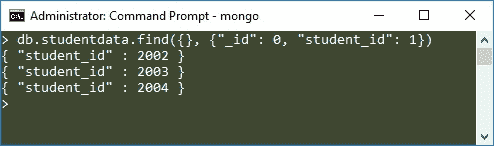

# MongoDB 投影

> 原文： [https://beginnersbook.com/2017/09/mongodb-projection/](https://beginnersbook.com/2017/09/mongodb-projection/)

在之前的教程中，我们学习了[如何在查询文档](https://beginnersbook.com/2017/09/mongodb-query-document-using-find-method/)时使用条件来从集合中获取所选文档。在本教程中，我们将学习 MongoDB 的另一个有趣话题，即 **MongoDB Projection** 。当我们想要获取文档的选定字段而不是所有字段时使用。

例如，我们有一个集合，其中存储了包含以下字段的文档：student_name，student_id，student_age 但我们只想查看所有学生的 student_id，那么在这种情况下我们可以使用 projection 来获取 student_id。

**语法：**

```
db.collection_name.find({},{field_key:1 or 0})
```

现在不要担心语法，我们将看到一个例子来理解这一点。

## MongoDB 投影示例

让我们举一个例子来理解 MongoDB 中的 Projection。我们有一个名为`studentdata`的集合，其中包含以下文档。

```
> db.studentdata.find().pretty()
{
        "_id" : ObjectId("59bf63380be1d7770c3982af"),
        "student_name" : "Steve",
        "student_id" : 2002,
        "student_age" : 22
}
{
        "_id" : ObjectId("59bf63500be1d7770c3982b0"),
        "student_name" : "Carol",
        "student_id" : 2003,
        "student_age" : 22
}
{
        "_id" : ObjectId("59bf63650be1d7770c3982b1"),
        "student_name" : "Tim",
        "student_id" : 2004,
        "student_age" : 23
}
```

要仅获取所有文档的 student_id，我们将使用以下投影：

```
> db.studentdata.find({}, {"_id": 0, "student_id": 1})
{ "student_id" : 2002 }
{ "student_id" : 2003 }
{ "student_id" : 2004 }
```



> 值 1 表示显示字段，0 表示不显示该字段。当我们在 Projection 中将字段设置为 1 时，除了 _id 之外，其他字段会自动设置为 0，因此为了避免 _id，我们需要在投影中将其专门设置为 0。反之亦然，当我们将少数字段设置为 0，其他字段自动设置为 1 时（参见下面的示例）

另一种做同样事情的方法：

```
> db.studentdata.find({}, {"_id": 0, "student_name": 0, "student_age": 0})
{ "student_id" : 2002 }
{ "student_id" : 2003 }
{ "student_id" : 2004 }
```

**重要提示：**
有些人在查询中使用 Projection 时可能会收到此错误：

```
Error: error: {
  "ok" : 0,
  "errmsg" : "Projection cannot have a mix of inclusion and exclusion.",
  "code" : 2,
  "codeName" : "BadValue"
}
```

当您将某些字段设置为 0 而其他字段设置为 1 时会发生这种情况，换句话说，您将混合包含和排除组合在一起，唯一的例外是 _id 字段。例如：以下 Query 将产生此错误：

```
db.studentdata.find({}, {"_id": 0, "student_name": 0, "student_age": 1})
```

这是因为我们将 student_name 设置为 0，将其他字段 student_age 设置为 1.我们不能混用这些。您可以将不想显示的字段设置为 0，或将字段设置为 1 以显示。