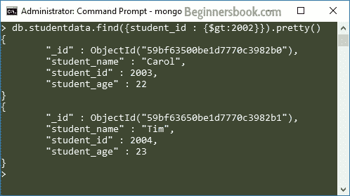

# MongoDB - limit（）和 skip（）方法

> 原文： [https://beginnersbook.com/2017/09/mongodb-limit-and-skip-method/](https://beginnersbook.com/2017/09/mongodb-limit-and-skip-method/)

在本教程中，我们将学习如何在 MongoDB 查询中使用 limit（）和 skip（）方法。

## MongoDB 中的 limit（）方法

此方法限制响应特定查询而返回的文档数。
语法：

```
db.collection_name.find().limit(number_of_documents)
```

让我们举一个例子来了解如何使用这种方法。可以说，我有一个集合`studentdata`，其中包含以下文件：

```
> db.studentdata.find().pretty()
{
        "_id" : ObjectId("59bf63380be1d7770c3982af"),
        "student_name" : "Steve",
        "student_id" : 2002,
        "student_age" : 22
}
{
        "_id" : ObjectId("59bf63500be1d7770c3982b0"),
        "student_name" : "Carol",
        "student_id" : 2003,
        "student_age" : 22
}
{
        "_id" : ObjectId("59bf63650be1d7770c3982b1"),
        "student_name" : "Tim",
        "student_id" : 2004,
        "student_age" : 23
}
```

让我们说我想找出所有学生的名单，ID 为&gt;我会用一个标准写一个这样的查询：

> 要了解在查询文档时如何指定条件，请阅读： [MongoDB 查询文档](https://beginnersbook.com/2017/09/mongodb-query-document-using-find-method/)

```
db.studentdata.find({student_id : {$gt:2002}}).pretty()
```



**使用 limit（）方法限制结果中的文件：**

让我说我不希望所有符合条件的文件。我只想选择一些文件，然后我可以使用 limit（）方法来限制文件的数量。例如，如果我只想输出一个文档，那么我会这样做：

```
> db.studentdata.find({student_id : {$gt:2002}}).limit(1).pretty()
{
        "_id" : ObjectId("59bf63500be1d7770c3982b0"),
        "student_name" : "Carol",
        "student_id" : 2003,
        "student_age" : 22
}
```

## MongoDB Skip（）方法

skip（）方法用于在 Query 结果中跳过给定数量的文档。

要理解 skip（）方法的使用，让我们采用上面我们看到的相同示例。在上面的例子中，我们可以看到，通过使用 limit（1），我们设法只获得一个文档，这是第一个与给定条件匹配的文档。如果您不希望第一个文档符合您的条件，该怎么办？例如，我们有两个文件，其 student_id 值大于 2002 但是当我们使用 limit（1）将结果限制为 1 时，我们得到了第一个文档，为了得到符合此条件的第二个文档，我们可以使用 skip（1） ）这里将跳过第一份文件。

**不使用 skip（）：**

```
> db.studentdata.find({student_id : {$gt:2002}}).limit(1).pretty()
{
        "_id" : ObjectId("59bf63500be1d7770c3982b0"),
        "student_name" : "Carol",
        "student_id" : 2003,
        "student_age" : 22
}
```

**使用跳过：**

```
> db.studentdata.find({student_id : {$gt:2002}}).limit(1).skip(1).pretty()
{
        "_id" : ObjectId("59bf63650be1d7770c3982b1"),
        "student_name" : "Tim",
        "student_id" : 2004,
        "student_age" : 23
}
```