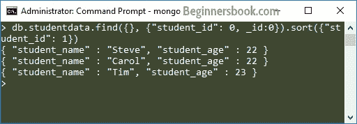

# MongoDB sort（）方法

> 原文： [https://beginnersbook.com/2017/09/mongodb-sort-method/](https://beginnersbook.com/2017/09/mongodb-sort-method/)

在本教程中，我们将学习如何使用 sort（）方法对文档进行排序。

## 使用 sort（）方法对文档进行排序

使用 sort（）方法，您可以根据文档的特定字段按升序或降序对文档进行排序。

**sort（）方法的语法：**

```
db.collecttion_name.find().sort({field_key:1 or -1})
```

1 表示升序，-1 表示降序。默认值为 1\.
**
例如：**集合`studentdata`包含以下文档：

```
> db.studentdata.find().pretty()
{
        "_id" : ObjectId("59bf63380be1d7770c3982af"),
        "student_name" : "Steve",
        "student_id" : 2002,
        "student_age" : 22
}
{
        "_id" : ObjectId("59bf63500be1d7770c3982b0"),
        "student_name" : "Carol",
        "student_id" : 2003,
        "student_age" : 22
}
{
        "_id" : ObjectId("59bf63650be1d7770c3982b1"),
        "student_name" : "Tim",
        "student_id" : 2004,
        "student_age" : 23
}
```

假设我想以**降序**显示所有文档的`student_id`：

> 要仅显示特定的文档字段，我使用的是 [MongoDB 投影](https://beginnersbook.com/2017/09/mongodb-projection/)

```
> db.studentdata.find({}, {"student_id": 1, _id:0}).sort({"student_id": -1})
{ "student_id" : 2004 }
{ "student_id" : 2003 }
{ "student_id" : 2002 }
```

要以**升序**显示所有学生的 student_id 字段：

```
> db.studentdata.find({}, {"student_id": 1, _id:0}).sort({"student_id": 1})
{ "student_id" : 2002 }
{ "student_id" : 2003 }
{ "student_id" : 2004 }
```

**默认值：**默认为升序，所以如果我在 sort（）方法中没有提供任何值，那么它将按升序对记录进行排序，如下所示：

```
> db.studentdata.find({}, {"student_id": 1, _id:0}).sort({})
{ "student_id" : 2002 }
{ "student_id" : 2003 }
{ "student_id" : 2004 }
```

**您还可以根据您不想显示的字段对文档进行排序：**例如，您可以根据 student_id 对文档进行排序，并显示 student_age 和 student_name 字段。

