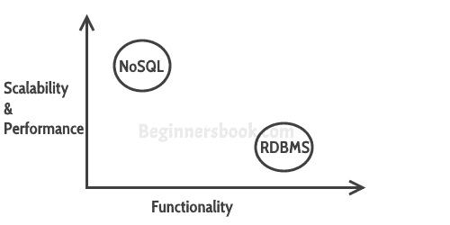

# NoSQL 数据库简介

> 原文： [https://beginnersbook.com/2017/09/introduction-to-nosql/](https://beginnersbook.com/2017/09/introduction-to-nosql/)

数据库管理系统提供存储和检索数据的机制。有不同种类的数据库管理系统：
1.  RDBMS（关系数据库管理系统）
2.  OLAP（在线分析处理）
3.  NoSQL（不仅是 SQL）

在本指南中，我们将讨论 NoSQL。 **NoSQL 数据库**的创建是为了克服关系数据库的局限性。

## 什么是 NoSQL 数据库？

NoSQL 数据库与 MQSql 等关系数据库不同。在关系数据库中，您需要创建表，定义模式，设置字段的数据类型等，然后才能实际插入数据。在 NoSQL 中你不必担心，你可以动态插入，更新数据。

NoSQL 数据库的一个优点是它们非常容易扩展，并且它们在我们在数据库上执行的大多数类型的操作中要快得多。在某些情况下，您更喜欢关系数据库而不是 NoSQL，但是当您处理大量数据时，NoSQL 数据库是您的最佳选择。

## 关系数据库的局限性

1.  在关系数据库中，我们需要首先定义数据的结构和模式，然后才能处理数据。

2.  关系数据库系统通过强制执行 [ACID 属性](https://beginnersbook.com/2015/04/acid-properties-in-dbms/)（原子性，一致性，隔离性和持久性）来提供数据的一致性和完整性。在某些情况下，这有点像银行系统一样有用。但是，在大多数其他情况下，这些属性是显着的性能开销，并且可能使您的数据库响应非常慢。

3.  大多数应用以 [JSON](https://beginnersbook.com/2015/04/json-tutorial/) 格式存储数据，而 RDBMS 不为您提供更好的方法来对此数据执行创建，插入，更新，删除等操作。另一方面，NoSQL 以 JSON 格式存储数据，这与当今世界的大多数应用兼容。

## NoSQL 的优点是什么？

使用 NoSQL 数据库（如 MongoDB 和 Cassandra）有几个优点。主要优点是高可扩展性和高可用性。

**高可扩展性：** NoSQL 数据库（如 MongoDB）使用分片进行水平扩展。分片是对数据进行分区并将其放置在多台机器上，以保持数据的顺序。垂直扩展意味着向现有机器添加更多资源，而水平扩展意味着添加更多机器来处理数据。垂直缩放并不容易实现，另一方面，水平缩放很容易实现。水平扩展数据库示例：MongoDB，Cassandra 等。由于此功能，NoSQL 可以处理大量数据，因为数据增长 NoSQL 扩展自身以高效处理该数据。

**高可用性：** MongoDB 中的自动复制功能使其具有高可用性，因为如果发生任何故障，数据会将自身复制到先前的一致状态。

## NoSQL 数据库的类型

以下是 NoSQL 数据库的类型以及属于该类别的数据库系统的名称。 MongoDB 属于基于 NoSQL 文档的数据库类别。
**Key Value Store：** Memcached，Redis，Coherence
**表格：** Hbase，Big Table，Accumulo
**基于文档：** MongoDB，CouchDB ，Cloudant

## RDBMS 与 NoSQL

**[RDBMS：](https://beginnersbook.com/2015/04/rdbms-concepts/)** 它是一种结构化数据，提供更多功能但性能更低。
**NoSQL：**结构化或半结构化数据，功能更少，性能更高。

### 所以当我在 NoSQL 中说较少的功能时缺少什么：

1.  NoSQL 中没有约束
2.  NoSQL 不支持连接
这些支持实际上阻碍了数据库的可伸缩性，因此在使用像 MongoDB 这样的 NoSQL 数据库时，可以在应用中实现这些功能水平。

## 什么时候去 NoSQL

当您想要在关系数据库上选择 NoSQL 时：

1.  当您想要存储和检索大量数据时。
2.  您存储的数据之间的关系并不重要
3.  数据不是结构化的，而是随着时间而变化
4.  数据库级别不需要约束和联接支持
5.  数据不断增长，您需要定期扩展数据库以处理数据。