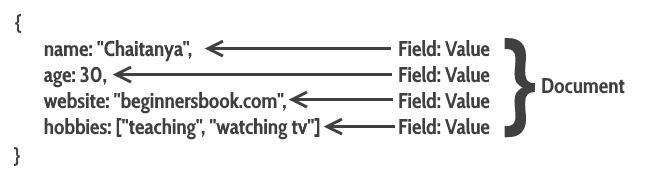
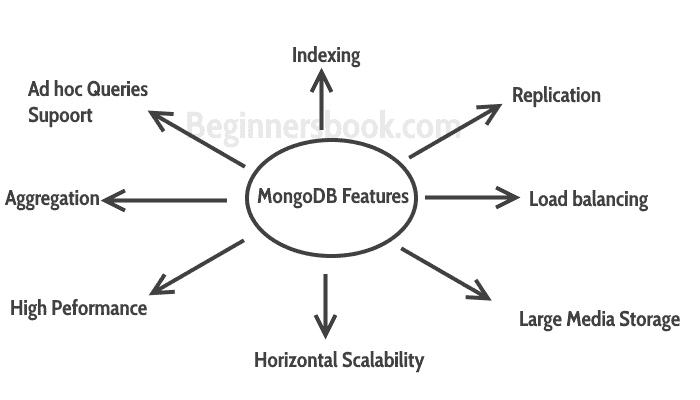

# MongoDB 简介

> 原文： [https://beginnersbook.com/2017/09/introduction-to-mongodb/](https://beginnersbook.com/2017/09/introduction-to-mongodb/)

MongoDB 是一个面向文档的开源数据库，它以文档（键和值对）的形式存储数据。正如我们上一篇教程（ [NoSQL 介绍](https://beginnersbook.com/2017/09/introduction-to-nosql/)）中所讨论的那样，基于文档的数据库是 NoSQL 数据库的一种类型。

**什么是文件？**
如果您来自关系数据库背景，那么您可以将它们视为 RDBMS 中的行。关系数据库和 MongoDB 之间的映射将在下一个教程中介绍，所以如果你想知道 MongoDB 中的行，表，列的等价物，你一定要检查它：[将关系数据库映射到 MongoDB](https://beginnersbook.com/2017/09/mapping-relational-databases-to-mongodb/) 。



```
{
   name: "Chaitanya",
   age: 30,
   website: "beginnersbook.com",
   hobbies: ["Teaching", "Watching TV"]
}
```

这是 [JSON](https://beginnersbook.com/2015/04/json-tutorial/) 之类的结构。数据以密钥和值对的形式存储的位置。

## MongoDB 的历史

MongoDB 是由 Eliot 和 Dwight（DoubleClick 的创始人）于 2007 年创建的，当时他们在使用关系数据库时遇到了可扩展性问题。开发 MongoDB 的组织最初称为 10gen。

2009 年 2 月，他们改变了商业模式，并将 MongoDB 作为开源项目发布。该组织于 2013 年更名，现称为 MongoDB Inc.

## MongoDB 的功能


1\. MongoDB 提供**高性能**。与关系数据库相比，MongoDB 中的大多数操作都更快。
2\. MongoDB 提供**自动复制**功能，允许您在发生故障时快速恢复数据。
3.由于共享，MongoDB 中可以进行水平缩放。分片是对数据进行分区并将其放置在多台机器上，以保持数据的顺序。
**水平缩放与垂直缩放：**
垂直缩放意味着向现有机器添加更多资源，而水平缩放意味着添加更多机器来处理数据。垂直缩放并不容易实现，另一方面，水平缩放很容易实现。水平扩展数据库示例：MongoDB，Cassandra 等
4\. **负载均衡**：水平扩展允许 MongoDB 平衡负载。
5\. **高可用性**：自动复制提高了 MongoDB 数据库的可用性。
6\. **索引：**索引是文档中的单个字段。索引用于快速定位数据，而无需搜索 MongoDB 数据库中的每个文档。这提高了在 MongoDB 数据库上执行的操作的性能。