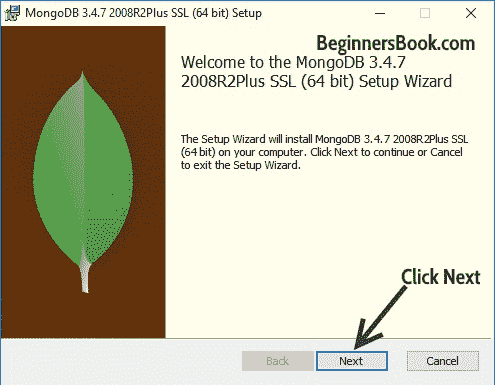
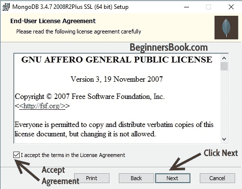
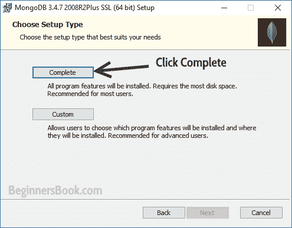
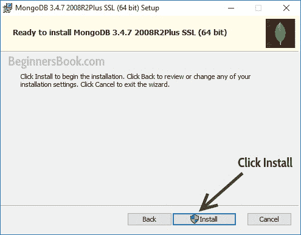
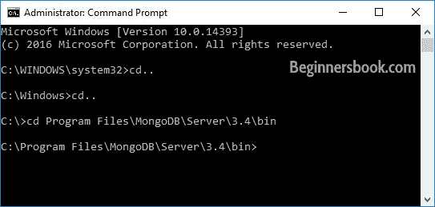
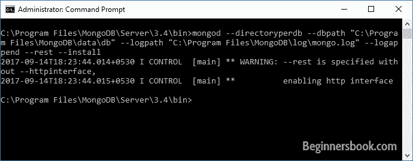
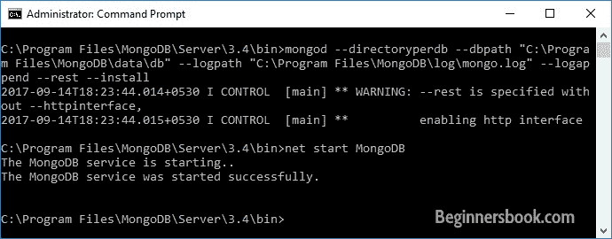
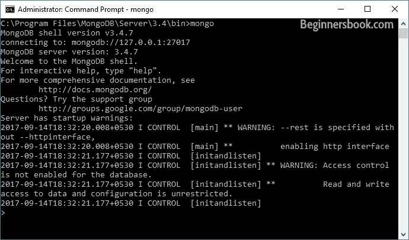

# 如何安装和配置 MongoDB for Windows

> 原文： [https://beginnersbook.com/2017/09/how-to-install-and-configure-mongodb-for-windows/](https://beginnersbook.com/2017/09/how-to-install-and-configure-mongodb-for-windows/)

这是**在 Windows** 上安装 MongoDB 的完整分步指南。

## 在 Windows 上安装 MongoDB

步骤 1：转到 [MongoDB 下载页面](https://www.mongodb.com/download-center#community)并单击下载，如屏幕截图所示。像这样的.msi 文件 **mongodb-win32-x86_64-2008plus-ssl-3.4.7-signed** 将在你的系统中下载。双击该文件以运行安装程序。


步骤 2：弹出 MongoDB 安装窗口时单击“下一步”。



步骤 3：接受 MongoDB 用户协议，然后单击“下一步”。



步骤 4：当安装程序要求您选择安装类型时，选择完成。



步骤 5：单击 Install 开始安装。



第 6 步：就是这样。 MongoDB 安装完成后，单击 Finish。

**我们没有在这里完成。** 在开始使用 MongoDB 之前，我们需要做几个步骤。

## MongoDB 配置

**步骤 1** ：找到已安装 MongoDB 的文件夹。如果您已按照上述步骤操作，则可以在此位置找到该文件夹​​：

```
C:\Program Files\MongoDB
```

在这里，您需要创建 MongoDB 配置所需的几个文件夹。

1.  在此处创建两个文件夹，将它们命名为**数据**和 **log** 。
2.  在**数据**中创建另一个文件夹，并将其命名为 **db** ，这是所有数据的存储位置。
这就是关闭窗口。

**步骤 2** ：打开命令提示符（右键单击并以管理员身份运行）。导航到 MongoDB 的 **bin** 文件夹，如屏幕截图所示。根据您安装 MongoDB 的位置，bin 文件夹的路径可能会有所不同。



**步骤 3** ：配置数据&amp;通过键入此命令将日志文件夹和 MongoDB 设置为服务。 **注意：**这是一行命令。

```
mongod --directoryperdb --dbpath "C:\Program Files\MongoDB\data\db" 
--logpath "C:\Program Files\MongoDB\log\mongo.log" --logappend --rest --install
```



**第 4 步**：现在您可以通过输入以下命令启动 MongoDB 作为服务：

```
net start MongoDB
```

您应该看到一条消息“MongoDB 服务已成功启动”。



这就是一切都完成了。现在我们应该在 MongoDB shell 中工作，我们可以通过在 bin 目录中键入此命令来运行它。

```
mongo
```



在下一个教程中，我们将学习如何在 MongoDB shell 中工作。

如果要退出 shell，可以通过键入 quit（）或使用 Ctrl-C 来执行此操作，然后可以使用以下命令停止 MongoDB 服务：

```
net stop MongoDB
```