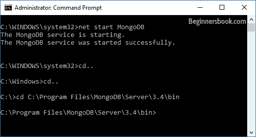
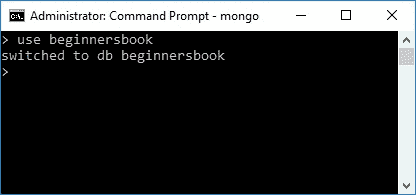
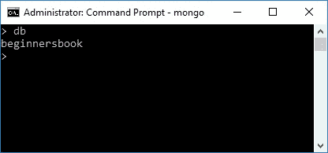
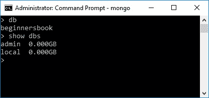
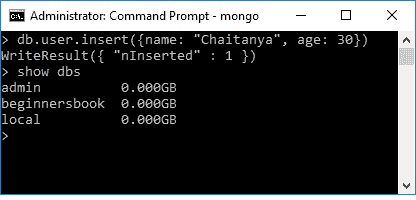

# 在 MongoDB 中创建数据库

> 原文： [https://beginnersbook.com/2017/09/mongodb-create-database/](https://beginnersbook.com/2017/09/mongodb-create-database/)

在本教程中，我们将了解如何在 MongoDB 中创建和使用数据库。

## MongoDB 创建数据库

键入以下命令启动 MongoDB 服务：

```js
net start MongoDB
```

你应该看到这样的消息：

```js
The MongoDB service is starting..
The MongoDB service was started successfully.
```

导航到 MongoDB 的`bin`目录，如下面的屏幕截图所示：



现在我们应该在 MongoDB shell 中工作。要运行 MongoDB shell，请键入以下命令：

```js
mongo
```

进入 MongoDB shell 后，通过键入以下命令在 MongoDB 中创建数据库：

```js
use database_name
```

例如，我正在创建一个数据库`beginnersbook`，所以命令应该是：

```js
use beginnersbook
```

**注意：**如果您提到的数据库名称已存在，则此命令将连接到数据库。但是，如果数据库不存在，那么这将创建具有给定名称的数据库并将您连接到它。



在任何时候，如果要检查当前连接的数据库，只需键入命令`db`。此命令将显示您当前连接的数据库名称。当您使用多个数据库时，这是非常有用的命令，因此在创建集合或在数据库中插入文档之前，您可能希望确保您位于正确的数据库中。

```js
> db
beginnersbook
```



要列出所有数据库，请使用命令`show dbs`。此命令列出磁盘上的所有数据库及其大小。

```js
> show dbs
admin  0.000GB
local  0.000GB
```



> 如您所见，我们创建的数据库`beginnersbook`不存在于所有数据库的列表中。这是因为在将文档保存到数据库之前不会创建数据库

现在我们正在创建一个集合`user`并在其中插入文档。

> 我们将在下一个教程中学习如何创建集合和文档。

```js
> db.user.insert({name: "Chaitanya", age: 30})
WriteResult({ "nInserted" : 1 })
> show dbs
admin          0.000GB
beginnersbook  0.000GB
local          0.000GB
```



您现在可以看到创建了数据库`beginnersbook`。