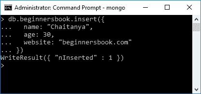
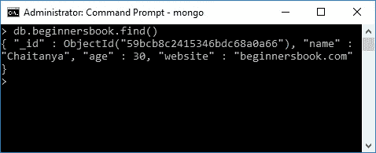
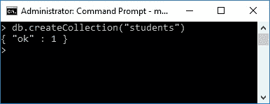
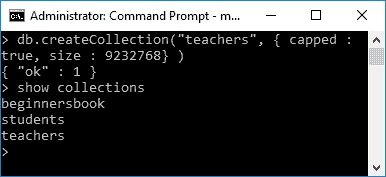

# 在 MongoDB 中创建集合

> 原文： [https://beginnersbook.com/2017/09/mongodb-create-collection/](https://beginnersbook.com/2017/09/mongodb-create-collection/)

我们知道 MongoDB 中的数据是以文档的形式存储的。这些文档存储在集合中，集合存储在数据库中。在上一篇教程中，我们学习了[如何在 MongoDB](https://beginnersbook.com/2017/09/mongodb-create-database/) 中创建数据库。在本指南中，我将向您展示在 MongoDB 中创建集合的两种方法。

## 方法 1：动态创建 MongoDB 中的集合

MongoDB 很酷的一点是，在将文档插入其中之前不需要创建集合。使用单个命令，您可以在集合中插入文档，MongoDB 即时创建该集合。
语法：`db.collection_name.insert({key: value, key: value ...})`

例如：我们在数据库`beginnersbookdb`中没有集合`beginnersbook`。此命令将动态创建名为`beginnersbook`的集合，并使用指定的键和值对在其中插入文档。

```
> use beginnersbookdb
switched to db beginnersbookdb

db.beginnersbook.insert({
  name: "Chaitanya",
  age: 30,
  website: "beginnersbook.com"
})
```

您将在命令提示符中看到此响应。

```
WriteResult({ "nInserted" : 1 })
```



要检查文档是否已成功插入，请键入以下命令。它显示给定集合中的所有文档。

语法：`db.collection_name.find()`

```
> db.beginnersbook.find()
{ "_id" : ObjectId("59bcb8c2415346bdc68a0a66"), "name" : "Chaitanya",
 "age" : 30, "website" : "beginnersbook.com" }
```



要检查是否已成功创建集合，请使用以下命令。

```
show collections
```

此命令显示当前所选数据库中所有集合的列表。

```
> show collections
beginnersbook
```

## 方法 2：在插入文档之前使用选项创建集合

我们还可以在实际插入数据之前创建集合。此方法为您提供了在创建集合时可以设置的选项。

语法：

```
db.createCollection(name, options)
```

`name`是集合名称，`options`是一个可选字段，我们可以用它来指定集合中的某些参数，如大小，文档的最大数量等。

首先让我们看看这个命令如何用于创建没有任何参数的集合：

```
> db.createCollection("students")
{ "ok" : 1 }
```



让我们看看我们在创建集合时可以提供的选项：

`capped`：类型：布尔值。

此参数仅为`true`和`false`。这指定了集合可以拥有的最大条目的上限。一旦集合达到该限制，它就会开始覆盖旧条目。

这里需要注意的是，当您将`capped`选项设置为`true`时，您还必须指定`size`参数。

`size`：类型：数字。

指定集合的​​最大大小（上限集合），以字节为单位。

`max`：类型：数字。

指定集合可容纳的最大文档数。

`autoIndexId`：类型：布尔值

此参数的默认值为`false`。如果将其设置为`true`，则会自动为每个文档创建索引字段`_id`。我们将在 MongoDB 索引教程中了解索引。

让我们看一个上限集合的例子：

```
db.createCollection("teachers", { capped : true, size : 9232768} )
{ "ok" : 1 }

```

此命令将创建名为`teachers`的集合，其最大大小为 9232768 字节。一旦此集合达到该限制，它将开始覆盖旧条目。

