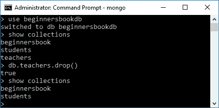

# 删除 MongoDB 中的集合

> 原文： [https://beginnersbook.com/2017/09/mongodb-drop-collection/](https://beginnersbook.com/2017/09/mongodb-drop-collection/)

在上一个教程中，我们学习了[如何在 MongoDB](https://beginnersbook.com/2017/09/mongodb-create-collection/) 中创建集合。在本指南中，我们将了解如何在 MongoDB 中删除集合。

要删除集合，首先连接到要删除集合的数据库，然后键入以下命令以删除集合：

```
db.collection_name.drop()
```

> 注意：删除集合后，所有文档以及与它们关联的索引也将被删除。为了保留索引，我们使用 remove（）函数，该函数仅删除集合中的文档，但不删除集合本身及其上创建的索引。我们将在后面的教程中学习索引和 remove（）函数。

## MongoDB drop collection 示例

例如，我想在我的数据库“beginnersbook.com”中删除集合名称“teachers”。为此，我将按给定的顺序编写以下命令。

```
> use beginnersbookdb
switched to db beginnersbookdb

> show collections
beginnersbook
students
teachers

> db.teachers.drop()
true

> show collections
beginnersbook
students
```

正如您所看到的，命令 db.teachers.drop（）返回 true，这意味着该集合已成功删除。我们在删除后使用 show collections 命令验证了同样的事情，如上所示。

