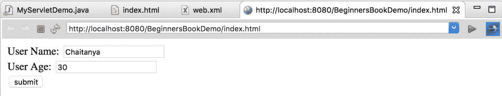
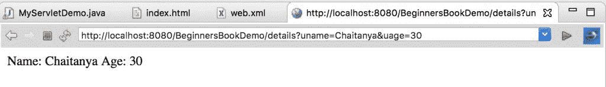
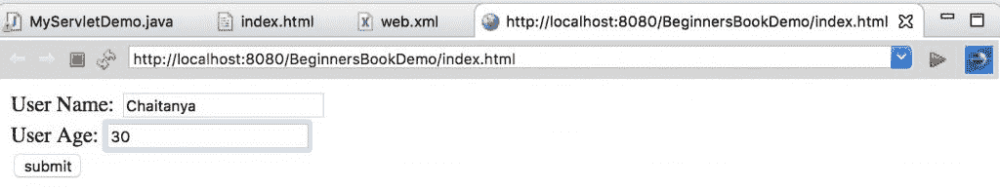
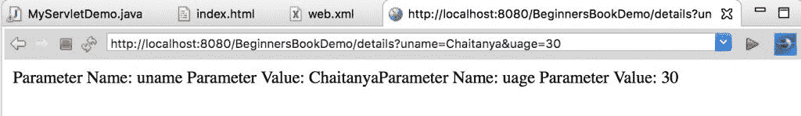
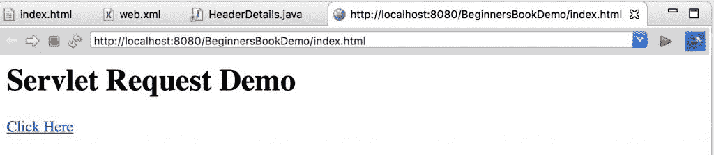
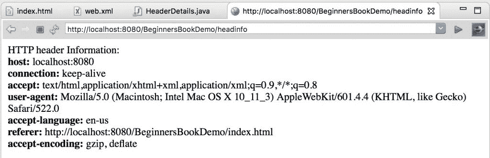

# ServletRequest 接口与示例

> 原文： [https://beginnersbook.com/2013/05/servlet-request-interface/](https://beginnersbook.com/2013/05/servlet-request-interface/)

当客户端向 Web 服务器发送请求时，servlet 容器会创建 ServletRequest＆amp; ServletResponse 对象并将它们作为参数传递给 servlet 的 service（）方法。请求对象提供对请求信息的访问，例如请求数据的头和主体信息。

首先，我们将看到一个示例，然后我们将看到 ServletRequest 接口中可用的方法列表：

## 示例 1：ServletRequest getParameter（）方法显示用户输入

在这个例子中，我演示了使用 getParameter（）方法返回给定参数的值。

在这个 html 表单中，我们将用户输入（名称和年龄）分别存储在参数`uname`和`uage`中。
index.html

```java
<form action="details" method="get">
 User Name: <input type="text" name="uname"><br>
 User Age: <input type="text" name="uage"><br>
 <input type="submit" value="submit">
</form>
```

MyServletDemo.java
在这个 servlet 类中，我们通过使用 getParameter（）方法获取参数的值，此方法属于 ServletRequest 接口。在这个例子中，我们将 HttpServletRequest 作为 doGet（）方法的参数，HttpServletRequest 扩展了 ServletRequest 接口，这就是为什么 getParameter（）方法可用于`req`对象。

获取值后，我们将在网页上编写它们。

```java
import javax.servlet.http.*; 
import javax.servlet.*; 
import java.io.*; 
public class MyServletDemo extends HttpServlet{ 
   public void doGet(HttpServletRequest req,HttpServletResponse res) 
   throws ServletException,IOException 
   {  
     res.setContentType("text/html"); 
     PrintWriter pwriter=res.getWriter(); 

     String name = req.getParameter("uname");
     String age = req.getParameter("uage");
     pwriter.println("Name: "+name); 
     pwriter.println("Age: "+age); 
     pwriter.close(); 
  }
}
```

Web.xml
这是将 servlet 映射到 url 的部署描述符文件。由于我们的表单将详细信息页面作为操作，因此我们将 servlet 类映射到详细信息页面。

```java
<web-app>
<display-name>BeginnersBookDemo</display-name>
   <welcome-file-list>
   <welcome-file>index.html</welcome-file>
   <welcome-file>index.htm</welcome-file>
   <welcome-file>index.jsp</welcome-file>
   <welcome-file>default.html</welcome-file>
   <welcome-file>default.htm</welcome-file>
   <welcome-file>default.jsp</welcome-file>
   </welcome-file-list>
<servlet>
   <servlet-name>BeginnersBook</servlet-name>
   <servlet-class>MyServletDemo</servlet-class>
</servlet>
```

```java
<servlet-mapping>
   <servlet-name>BeginnersBook</servlet-name>
   <url-pattern>/details</url-pattern>
</servlet-mapping>
</web-app>
```

**输出：**
屏幕 1：

点击提交时出现的屏幕 2：


## 示例 2：获取参数名称和值

在此示例中，我们将使用 getParameterNames（）和 getParameter（）方法来获取参数名称和值。
getParameterNames（）：返回一个 String 对象的枚举，其中包含此请求中包含的参数的名称。如果请求没有参数，则该方法返回一个空的枚举。

getParameter（）：如上所述，这将返回给定参数的值。
**index.html**

```java
<form action="details" method="get">
 User Name: <input type="text" name="uname"><br>
 User Age: <input type="text" name="uage"><br>
 <input type="submit" value="submit">
</form>

```

MyServletDemo.class

```java
import java.io.IOException;
import java.io.IOException;
import java.io.PrintWriter;
import java.util.Enumeration; 
import javax.servlet.ServletException;
import javax.servlet.http.HttpServlet;
import javax.servlet.http.HttpServletRequest;
import javax.servlet.http.HttpServletResponse;
public class MyServletDemo extends HttpServlet{    
   public void doGet(HttpServletRequest req,HttpServletResponse res)    
      throws ServletException,IOException    
   {     
      PrintWriter pwriter=res.getWriter(); res.setContentType("text/html");
      Enumeration en=req.getParameterNames();
      while(en.hasMoreElements()) 
      { 
          Object obj=en.nextElement(); 
          String param=(String)obj; 
          String pvalue=req.getParameter(param); 
          pwriter.print("Parameter Name: "+param+  
             " Parameter Value: "+pvalue); 
      } 
      pwriter.close();   

    }
}

```

web.xml 中

```java
<web-app>
<servlet>
 <servlet-name>BeginnersBook</servlet-name>
 <servlet-class>MyServletDemo</servlet-class>
</servlet>
<servlet-mapping>
 <servlet-name>BeginnersBook</servlet-name>
 <url-pattern>/details</url-pattern>
</servlet-mapping>
</web-app>

```

**输出：**




## 示例 3：显示标题信息

index.html

```java
<h1>Servlet Request Demo</h1>
<body>
<a href="headinfo">Click Here</a>
</body>

```

HeaderDetails.java

```java
import java.io.IOException;
import java.io.PrintWriter;
import java.util.Enumeration;
import javax.servlet.ServletException;
import javax.servlet.http.HttpServlet;
import javax.servlet.http.HttpServletRequest;
import javax.servlet.http.HttpServletResponse;

public class HeaderDetails extends HttpServlet {

  public void doGet(HttpServletRequest request,
     HttpServletResponse response)
        throws IOException, ServletException 
  {
     response.setContentType("text/html");
     PrintWriter pwriter = response.getWriter();

     pwriter.println("HTTP header Information:<br>");

     Enumeration en = request.getHeaderNames();
     while (en.hasMoreElements()) {
        String hName = (String) en.nextElement();
        String hValue = request.getHeader(hName);
        pwriter.println("<b>"+hName+": </b>"
             +hValue + "<br>");
     }
  }
}
```

web.xml

```java
<web-app>
<welcome-file-list>
 <welcome-file>index.html</welcome-file>
 <welcome-file>index.htm</welcome-file>
 <welcome-file>index.jsp</welcome-file>
 <welcome-file>default.html</welcome-file>
 <welcome-file>default.htm</welcome-file>
 <welcome-file>default.jsp</welcome-file>
 </welcome-file-list>

 <servlet>
 <servlet-name>BeginnersBook</servlet-name>
 <servlet-class>HeaderDetails</servlet-class>
</servlet>
<servlet-mapping>
 <servlet-name>BeginnersBook</servlet-name>
 <url-pattern>/headinfo</url-pattern>
</servlet-mapping>
</web-app>
```

**输出：**



## ServletRequest 接口的方法

**String getParameter（String name）**：它将给定参数的值作为 String 返回，如果给定的参数不存在，则返回 null。

**Enumeration getParameterNames（）**：它返回一个包含请求中参数名称的字符串 Enumeration 对象。

**String [] getParameterValues（String name）**：它返回一个包含所有值的字符串数组，参数 has，如果参数没有任何值，则返回 null。

**String getCharacterEncoding（）**：返回此请求正文中使用的字符编码的名称。如果请求未指定字符编码，则此方法返回 null。

**void setCharacterEncoding（String env）**：覆盖请求正文中的字符编码。

**int getContentLength（）**：以字节为单位返回请求内容的长度。

**String getContentType（）**：返回请求正文的 MIME 类型，如果类型未知，则返回 null。

注意：我刚刚提到了一些方法。如果您需要完整的方法列表，请参阅[官方文档](https://docs.oracle.com/javaee/7/api/javax/servlet/ServletRequest.html)。