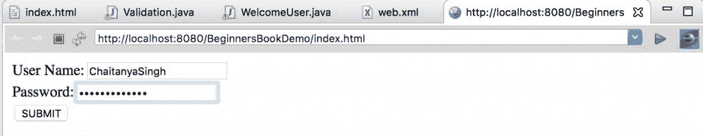
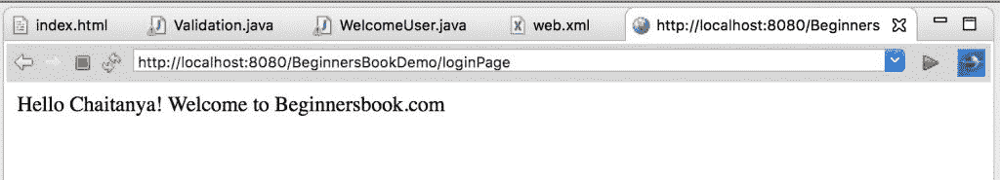

# Servlet 中的`RequestDispatcher`方法

> 原文： [https://beginnersbook.com/2017/07/requestdispatcher-methods-with-examples-in-servlet/](https://beginnersbook.com/2017/07/requestdispatcher-methods-with-examples-in-servlet/)

`RequestDispatcher`接口定义一个对象，该对象从客户端接收请求并将其分派给资源（例如 servlet，JSP，HTML 文件）。该接口有以下两种方法：

`public void forward(ServletRequest request, ServletResponse response)`：它将请求从一个 servlet 转发到另一个资源（例如 servlet，JSP，HTML 文件）。

`public void include(ServletRequest request, ServletResponse response)`：它包含响应中的资源内容（如 servlet，JSP，HTML 文件）。

## `forward()`与`include()`方法的区别

为了理解这两种方法之间的区别，让我们举一个例子：假设你有两个页面`X`和`Y`。在页面`X `中你有一个`include`标签，这意味着控制流将在页面`X`中，直到它遇到包含标签，之后控制流将被转移到页面`Y`。在页面`Y`的处理结束时，控制流将返回到包含标签之后的页面`X`并保持在`X`直到结束。

**在这种情况下，客户的最终回复将由`X`页面发送。**

现在，我们正在采用相同的例子。我们有相同的页面`X`和`Y`。在页面`X`中，我们有转发标签。在这种情况下，控制流将在页面`X`中，直到它遇到转发，此后控制流将被转移到页面`Y`。这里的主要区别是控制流不会返回到`X`，它将在页面`Y`中直到结束它的。

**在这种情况下，对客户的最终回复将由`Y`页面发送。**

## 例：

在这个例子中，我将使用`include`和`forward`两种方法。使用`include`方法，我将更改当前页面的内容，当我准备将控制流转移到下一页时，我将使用`forward`方法。

`index.html`

```java
<form action="loginPage" method="post"> 
  User Name:<input type="text" name="uname"/><br/> 
  Password:<input type="password" name="upass"/><br/> 
  <input type="submit" value="SUBMIT"/> 
</form> 

```

`Validation.java`

```java
import java.io.*;  
import java.io.*;  
import javax.servlet.*;  
import javax.servlet.http.*;      
public class Validation extends HttpServlet 
{    
   public void doPost(HttpServletRequest request, 
     HttpServletResponse response) 
       throws ServletException, IOException 
   {        
       response.setContentType("text/html");      
       PrintWriter pwriter = response.getWriter();                
       String name=request.getParameter("uname");      
       String pass=request.getParameter("upass");                
       if(name.equals("Chaitanya") && 
          pass.equals("beginnersbook"))
       {          
          RequestDispatcher dis=request.getRequestDispatcher("welcome");          
          dis.forward(request, response);      
       }     
       else
       {      
          pwriter.print("User name or password is incorrect!");          
          RequestDispatcher dis=request.getRequestDispatcher("index.html");          
          dis.include(request, response);                                
       }      
   }    
}  

```

`WelcomeUser.java`

```java
import java.io.*; 
import javax.servlet.*; 
import javax.servlet.http.*; 

public class WelcomeUser extends HttpServlet { 

 public void doPost(HttpServletRequest request, 
 HttpServletResponse response) 
 throws ServletException, IOException 
 { 

    response.setContentType("text/html"); 
    PrintWriter pwriter = response.getWriter(); 

    String name=request.getParameter("uname"); 
    pwriter.print("Hello "+name+"!");
    pwriter.print(" Welcome to Beginnersbook.com"); 
 } 

} 

```

`web.xml`

```java
<web-app>
 <display-name>BeginnersBookDemo</display-name>
 <welcome-file-list>
 <welcome-file>index.html</welcome-file>
 </welcome-file-list>

 <servlet>
 <servlet-name>Login</servlet-name>
 <servlet-class>Validation</servlet-class>
 </servlet>
 <servlet>
 <servlet-name>Welcome</servlet-name>
 <servlet-class>WelcomeUser</servlet-class>
 </servlet>
 <servlet-mapping>
 <servlet-name>Login</servlet-name>
 <url-pattern>/loginPage</url-pattern>
 </servlet-mapping>
 <servlet-mapping>
 <servlet-name>Welcome</servlet-name>
 <url-pattern>/welcome</url-pattern>
 </servlet-mapping>
 <welcome-file-list>
 <welcome-file>index.html</welcome-file>
 </welcome-file-list>
</web-app>

```

**输出：**

输入错误的凭据：



错误屏幕：


输入正确的用户名和密码时欢迎屏幕：

