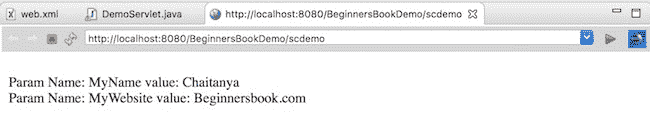

# ServletConfig 接口示例

> 原文： [https://beginnersbook.com/2017/07/servletconfig-interface-with-example/](https://beginnersbook.com/2017/07/servletconfig-interface-with-example/)

Servlet Container 在初始化期间为每个 Servlet 创建 ServletConfig 对象，以将信息传递给 Servlet。此对象可用于从部署描述符文件（web.xml）获取配置信息，例如参数名称和值。

## ServletConfig 接口的方法

**public String getInitParameter（String name）**：以 String 形式返回给定参数的值，如果 web.xml 中不存在给定参数，则返回 null。
**public Enumeration getInitParameterNames（）**：返回所有参数名称的枚举。
**public String getServletName（）**：返回 servlet 实例的名称。
**public ServletContext getServletContext（）**：返回 ServletContext 的一个对象。

## 例：

在这个例子中，我们将使用两个方法 getInitParameter（）和 getInitParameterNames（）来获取 web.xml 中的所有参数及其值。
getInitParameterNames（）方法返回所有参数名称的枚举，并通过在调用 getInitParameter（）方法期间传递这些名称，我们可以从 web.xml 获取相应的参数值。

**DemoServlet.java**

```java
import java.io.*;
import javax.servlet.*;
import javax.servlet.http.*;
import java.util.Enumeration;

public class DemoServlet extends HttpServlet {

   protected void doGet(HttpServletRequest request, 
      HttpServletResponse response)
        throws ServletException, IOException 
   {

      response.setContentType("text/html;charset=UTF-8");
      PrintWriter pwriter = response.getWriter();
      ServletConfig sc=getServletConfig();

      Enumeration<String> e=sc.getInitParameterNames();
      String str;
      while(e.hasMoreElements()) {
        str=e.nextElement();
        pwriter.println("<br>Param Name: "+str);
        pwriter.println(" value: "+sc.getInitParameter(str));
      }
   }
}
```

**web.xml**

```java
<web-app>
 <display-name>BeginnersBookDemo</display-name>
 <welcome-file-list>
 <welcome-file>index.html</welcome-file>
 </welcome-file-list>
 <servlet>
 <servlet-name>MyServlet</servlet-name>
 <servlet-class>DemoServlet</servlet-class>
 <init-param>
 <param-name>MyName</param-name>
 <param-value>Chaitanya</param-value>

 </init-param>
 <init-param>
 <param-name>MyWebsite</param-name>
 <param-value>Beginnersbook.com</param-value>
 </init-param>
 </servlet>
 <servlet-mapping>
 <servlet-name>MyServlet</servlet-name>
 <url-pattern>/scdemo</url-pattern>
 </servlet-mapping>
</web-app>

```

**输出：**

