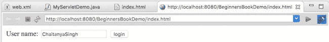

# ServletResponse 接口

> 原文： [https://beginnersbook.com/2013/05/servlet-response/](https://beginnersbook.com/2013/05/servlet-response/)

servlet 容器连接到 Web 服务器，该服务器从某个端口上的客户端接收 Http 请求。当客户端向 Web 服务器发送请求时，servlet 容器会创建`HttpServletRequest`和`HttpServletResponse`对象，并将它们作为参数传递给 servlet service（）方法。

响应对象允许您格式化并将响应发送回客户端。首先，我们将看到 ServletReponse 接口中常用的方法，然后我们将看到一个示例。

## ServletResponse 接口的方法

1）`String getCharacterEncoding()`：返回发送给客户端的响应正文中使用的 MIME 字符集的名称。

2）`String getContentType()`：返回响应内容类型。例如 text，html 等

3）`ServletOutputStream getOutputStream()`：返回一个适合在响应中写入二进制数据的 ServletOutputStream。

4）`java.io.PrintWriter getWriter()`：返回 PrintWriter 对象。

5）`void setCharacterEncoding(java.lang.String charset)`：设置响应的 MIME 字符集（字符编码）。

6）`void setContentLength(int len)`：设置响应体的长度。

7）`void setContentType(java.lang.String type)`：设置响应数据的类型。

8）`void setBufferSize(int size)`：设置缓冲区大小。

9）`int getBufferSize()`：返回缓冲区大小。

10）`void flushBuffer()`：强制将缓冲区中的任何内容写入客户端。

11）`boolean isCommitted()`：返回一个布尔值，指示响应是否已提交。

12）`void reset()`：清除缓冲区的数据以及标题和状态代码。
获取完整的方法列表。请参阅[官方文档](https://docs.oracle.com/javaee/7/api/javax/servlet/ServletResponse.html)。

## 例：

在下面的示例中，我们使用了 ServletResponse 接口的 setContentType（）和 getWriter（）方法。

index.html

```java
<form action="mydetails" method="get">
User name: <input type="text" name="uname">
<input type="submit" value="login">
</form>
```

MyServletDemo.java

```java
import javax.servlet.http.*;
import javax.servlet.*;
import java.io.*;
public class MyServletDemo extends HttpServlet{
   public void doGet(HttpServletRequest req,HttpServletResponse res)
   throws ServletException,IOException
   {
     res.setContentType("text/html");
     PrintWriter pwriter=res.getWriter();
     String name=req.getParameter("uname");
     pwriter.println("User Details Page:");
     pwriter.println("Hello "+name);
     pwriter.close();
  }
}
```

web.xml

```java
<web-app>
<servlet>
   <servlet-name>DemoServlet</servlet-name>
   <servlet-class>MyServletDemo</servlet-class>
</servlet>
<servlet-mapping> 
   <servlet-name>DemoServlet</servlet-name>
   <url-pattern>/mydetails</url-pattern>
</servlet-mapping>
</web-app>
```

**输出：**



屏幕 2：

