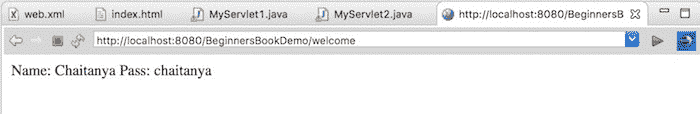

# HttpSession 与 Servlet 中的示例

> 原文： [https://beginnersbook.com/2013/05/http-session/](https://beginnersbook.com/2013/05/http-session/)

`HttpSession`对象用于会话管理。会话包含特定于整个应用中的特定用户的信息。当用户第一次通过 request.getSession（）获得 HttpSession 时进入网站（或在线应用）时，将为用户提供唯一 ID 以标识其会话。此唯一 ID 可以存储在 cookie 或请求参数中。

HttpSession 保持活动状态，直到它的使用时间超过部署描述符文件（web.xml）中 tag 中指定的超时值。默认超时值为 30 分钟，如果未在标记中指定值，则使用此值。这意味着当用户未访问指定的 Web 应用时间时，会话将被 servlet 容器销毁。后续请求将不再从此会话提供，servlet 容器将创建新会话。

这是您创建 HttpSession 对象的方法。

```java
protected void doPost(HttpServletRequest req,
    HttpServletResponse res)
    throws ServletException, IOException {
        HttpSession session = req.getSession();
}
```

您可以使用 setAttribute（）方法将用户信息存储到会话对象中，稍后在需要时可以从会话中获取此信息。这是您在会话中存储信息的方式。这里我们分别在属性名称为 uName，uemailId 和 uAge 的会话中存储用户名，emailid 和 userage。

```java
session.setAttribute("uName", "ChaitanyaSingh");
session.setAttribute("uemailId", "[email protected]");
session.setAttribute("uAge", "30");
```

第一个参数是属性名称，第二个是属性值。对于例如 uName 是属性名称，ChaitanyaSingh 是上面代码中的属性值。

要从会话中获取值，我们使用 HttpSession 接口的 getAttribute（）方法。这里我们使用属性名称获取属性值。

```java
String userName = (String) session.getAttribute("uName");
String userEmailId = (String) session.getAttribute("uemailId");
String userAge = (String) session.getAttribute("uAge");
```

## HttpSession 的方法

**public void setAttribute（String name，Object value）**：使用名称绑定对象，并将名称/值对存储为 HttpSession 对象的属性。如果属性已存在，则此方法将替换现有属性。

**public Object getAttribute（String name）**：从会话对象返回参数中指定的 String 对象。如果未找到指定属性的对象，则 getAttribute（）方法返回 null。

**public Enumeration getAttributeNames（）**：返回一个 Enumeration，其中包含作为会话对象的属性绑定的所有对象的名称。

**public void removeAttribute（String name）**：从会话中删除给定的属性。

**setMaxInactiveInterval（int interval）**：以秒为单位设置会话不活动时间。这是以秒为单位的时间，指定自客户端上次收到请求后会话保持活动状态的时间。

有关方法的完整列表，请参阅[官方文档](https://docs.oracle.com/javaee/7/api/javax/servlet/http/HttpSession.html)。

## 会话示例

index.html

```java
<form action="login">
  User Name:<input type="text" name="userName"/><br/>
  Password:<input type="password" name="userPassword"/><br/>
  <input type="submit" value="submit"/>
</form>
```

MyServlet1.java

```java
import java.io.*;
import javax.servlet.*;
import javax.servlet.http.*;
public class MyServlet1 extends HttpServlet {
   public void doGet(HttpServletRequest request, HttpServletResponse response){
     try{
      response.setContentType("text/html");
      PrintWriter pwriter = response.getWriter();

      String name = request.getParameter("userName");
      String password = request.getParameter("userPassword");
      pwriter.print("Hello "+name);
      pwriter.print("Your Password is: "+password);
      HttpSession session=request.getSession();
      session.setAttribute("uname",name);
      session.setAttribute("upass",password);
      pwriter.print("<a href='welcome'>view details</a>");
      pwriter.close();
    }catch(Exception exp){
       System.out.println(exp);
     }
  }
}
```

MyServlet2.java

```java
import java.io.*;
import javax.servlet.*;
import javax.servlet.http.*;
public class MyServlet2 extends HttpServlet {
  public void doGet(HttpServletRequest request, HttpServletResponse response){
  try{
      response.setContentType("text/html");
      PrintWriter pwriter = response.getWriter();
      HttpSession session=request.getSession(false);
      String myName=(String)session.getAttribute("uname");
      String myPass=(String)session.getAttribute("upass");
      pwriter.print("Name: "+myName+" Pass: "+myPass);
      pwriter.close();
  }catch(Exception exp){
      System.out.println(exp);
   }
  }
}
```

web.xml

```java
<web-app>
<servlet>
   <servlet-name>Servlet1</servlet-name>
   <servlet-class>MyServlet1</servlet-class>
</servlet>
<servlet-mapping>
   <servlet-name>Servlet1</servlet-name>
   <url-pattern>/login</url-pattern>
</servlet-mapping>
<servlet>
   <servlet-name>Servlet2</servlet-name>
   <servlet-class>MyServlet2</servlet-class>
</servlet>
<servlet-mapping>
   <servlet-name>Servlet2</servlet-name>
   <url-pattern>/welcome</url-pattern>
</servlet-mapping>
</web-app>
```

**输出：**
**第一屏：**


**点击提交后：**


**点击查看详细信息后：**
