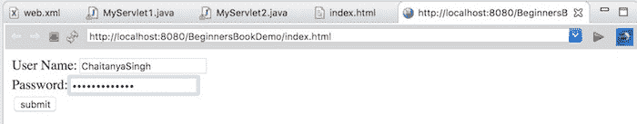
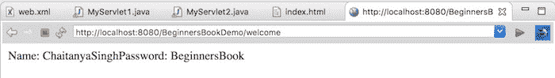

# Servlet 中的 Cookie 示例

> 原文： [https://beginnersbook.com/2013/05/servlet-cookies/](https://beginnersbook.com/2013/05/servlet-cookies/)

在上一篇指南中，我介绍了 Servlet 中的[会话。在这里，我们将讨论用于会话管理的 Cookie。让我们回顾一下上一篇教程中的一些内容，以便我们可以关联会话和 cookie。当用户第一次访问 Web 应用程序时，servlet 容器通过调用 request.getSession（）来创建新的 HttpSession 对象。为会话分配唯一​​的 ID。 **Servlet 容器还在 HTTP 响应的标头中设置 Cookie，其中包含 cookie 名称和唯一会话 ID 作为其值。**](https://beginnersbook.com/2013/05/http-session/)

cookie 存储在用户浏览器中，客户端（用户的浏览器）将此 cookie 发送回服务器以获取所有后续请求，直到 cookie 有效。 **Servlet 容器检查 cookie 的请求标头，并从 cookie 获取会话信息，并使用服务器内存中的关联会话。**

会话在 web.xml 中的 tag 中指定的时间内保持活动状态。如果未在 web.xml 中设置标记，则会话将保持活动状态 30 分钟。 **只要用户的浏览器正在运行**，Cookie 就会保持活动状态，一旦浏览器关闭，cookie 和相关的会话信息就会被破坏。因此，当用户再次打开浏览器并向 Web 服务器发送请求时，将创建新会话。

## 饼干的类型

我们可以根据 Cookie 的到期时间对 Cookie 进行分类：

1.  会议
2.  一贯

**1）会话 Cookie：**
会话 Cookie 没有到期时间。它存在于浏览器内存中。一旦 Web 浏览器关闭，该 cookie 就会被破坏。

**2）持久性 Cookie：**
与会话 Cookie 不同，它们具有到期时间，它们存储在用户硬盘中，并根据到期时间被销毁。

## 如何将 Cookie 发送给客户

以下是向客户端发送 cookie 的步骤：

1.  创建一个 Cookie 对象。
2.  设置最大年龄。
3.  将 Cookie 放在 HTTP 响应标头中。

#### 1）创建一个 Cookie 对象：

```java
Cookie c = new Cookie("userName","Chaitanya");

```

#### 2）设置最大年龄：

通过使用 **setMaxAge（）**方法，我们可以设置特定 cookie 的最大年龄（以秒为单位）。

```java
c.setMaxAge(1800);

```

#### 3）将 Cookie 放在 HTTP 响应头中：

我们可以通过`response.addCookie()`方法将 cookie 发送到客户端浏览器。

```java
response.addCookie(c);

```

## 如何阅读 cookies

```java
Cookie c[]=request.getCookies(); 
//c.length gives the cookie count 
for(int i=0;i<c.length;i++){  
 out.print("Name: "+c[i].getName()+" & Value: "+c[i].getValue());
}
```

## java servlet 中的 Cookie 示例

**index.html**

```java
<form action="login">
 User Name:<input type="text" name="userName"/><br/>
 Password:<input type="password" name="userPassword"/><br/>
 <input type="submit" value="submit"/>
</form>

```

**MyServlet1.java**

```java
import java.io.*;
import javax.servlet.*;
import javax.servlet.http.*;
public class MyServlet1 extends HttpServlet 
{
   public void doGet(HttpServletRequest request, 
      HttpServletResponse response) {
      try{
          response.setContentType("text/html");
          PrintWriter pwriter = response.getWriter();

          String name = request.getParameter("userName");
          String password = request.getParameter("userPassword");
          pwriter.print("Hello "+name);
          pwriter.print("Your Password is: "+password);

          //Creating two cookies
          Cookie c1=new Cookie("userName",name);
          Cookie c2=new Cookie("userPassword",password);

          //Adding the cookies to response header
          response.addCookie(c1);
          response.addCookie(c2);
          pwriter.print("<br><a href='welcome'>View Details</a>");
          pwriter.close();
   }catch(Exception exp){
       System.out.println(exp);
    }
  }
}
```

**MyServlet2.java**

```java
import java.io.*;
import javax.servlet.*;
import javax.servlet.http.*;
public class MyServlet2 extends HttpServlet {
 public void doGet(HttpServletRequest request, 
    HttpServletResponse response){
    try{
       response.setContentType("text/html");
       PrintWriter pwriter = response.getWriter();

       //Reading cookies
       Cookie c[]=request.getCookies(); 
       //Displaying User name value from cookie
       pwriter.print("Name: "+c[1].getValue()); 
       //Displaying user password value from cookie
       pwriter.print("Password: "+c[2].getValue());

       pwriter.close();
    }catch(Exception exp){
       System.out.println(exp);
     }
  }
}
```

**web.xml**

```java
<web-app>
<display-name>BeginnersBookDemo</display-name>
 <welcome-file-list>
 <welcome-file>index.html</welcome-file>
 </welcome-file-list>
<servlet>
 <servlet-name>Servlet1</servlet-name>
 <servlet-class>MyServlet1</servlet-class>
</servlet>
<servlet-mapping>
 <servlet-name>Servlet1</servlet-name>
 <url-pattern>/login</url-pattern>
</servlet-mapping>
<servlet>
 <servlet-name>Servlet2</servlet-name>
 <servlet-class>MyServlet2</servlet-class>
</servlet>
<servlet-mapping>
 <servlet-name>Servlet2</servlet-name>
 <url-pattern>/welcome</url-pattern>
</servlet-mapping>
</web-app>

```

**输出：**
**欢迎画面：**


**点击提交后：**


**点击查看详情后：**


## Cookie 类的方法

**public void setComment（String purpose）**：此方法用于在 cookie 中设置注释。这主要用于描述 cookie 的用途。

**public String getComment（）**：返回描述此 cookie 用途的注释，如果 cookie 没有注释，则返回 null。

**public void setMaxAge（int expiry）**：以秒为单位设置 cookie 的最大年龄。

**public int getMaxAge（）**：获取此 Cookie 的最大年龄（以秒为单位）。
默认情况下，返回-1，表示 cookie 将持续到浏览器关闭。

**public String getName（）**：返回 cookie 的名称。创建后无法更改名称。

**public void setValue（String newValue）**：为此 Cookie 指定一个新值。

**public String getValue（）**：获取此 Cookie 的当前值。

上面的列表只有常用的方法。要获得 Cookie 类的完整方法列表，请参阅[官方文档](https://docs.oracle.com/javaee/7/api/javax/servlet/http/Cookie.html)。