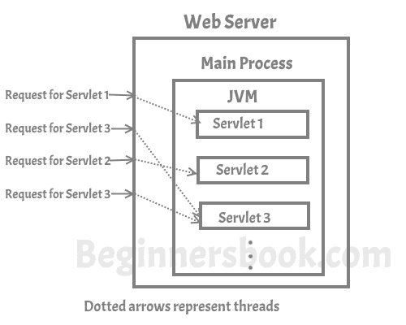

# 适用于初学者的 Servlet 教程

> 原文： [https://beginnersbook.com/2013/05/servlet-tutorial/](https://beginnersbook.com/2013/05/servlet-tutorial/)

Servlet 是一个在 Web 服务器上的 JVM 内运行的 java 程序。它用于开发动态 Web 应用程序。
在我们继续之前，让我们了解什么是**动态 Web 应用程序？** Web 应用程序可以被描述为网页集合（例如网站），当我们称之为动态时，它只是意味着所有用户的网页都不相同，网页将在服务器端生成根据客户端（用户的浏览器）的请求。

静态和动态网页之间的主要**区别在于，名称建议的静态页面对于所有用户保持相同，但是动态网页基于来自客户端（用户的浏览器）的请求而改变。例如，考虑一个 Web 应用程序，它向您显示两个输入字段＆amp;添加按钮，当您输入两个数字并单击添加时，它会显示另一个网页，其中包含两个数字的结果，此 Web 应用程序本质上是动态的，作为第二个网页，显示结果更改基于用户输入，对所有用户都不是静态的。**

但是你可以很好地说，一个 servlet 可以通过 CGI（通用网关接口）完成什么，这是真的，但这就是事情 - **CGI 有一些限制，如性能，可伸缩性，可重用性等等。没有**。我不打算详细讨论 CGI，但我要告诉你，servlet 如何比 CGI 更好。

### CGI 的局限性

服务器必须为每个客户端请求创建一个新的 CGI 进程。例如，如果 100 个用户正在访问 Web 应用程序，则服务器必须创建 100 个 CGI 进程来处理它们发出的请求。由于服务器资源有限，每次为新请求创建新进程都不是一个可行的选择，这会对服务器造成限制，因为服务器无法同时处理超过指定数量的用户。

### Servlet 如何比 CGI 更好

每次发出新请求时，CGI 程序都由新进程处理。与 CGI 不同，servlet 程序由可以更高效地并发运行的单独线程处理。

CGI 程序可以用任何编程语言编写，使其主要依赖于平台，因为并非所有编程语言都是独立于平台的。 Servlet 仅使用 Java 作为编程语言，使其与平台无关且可移植。使用 java 的另一个好处是 servlet 可以利用 java 的面向对象编程功能。

#### Servlet 如何工作

正如我上面提到的，对服务器的并发请求由线程处理，这里是相同的图形表示 -

## Servlet 的特点

现在我们已经了解了什么是 servlet 以及它正在被使用的目的。让我们进一步讨论它的主要特征。

**1.便携式：**
正如我上面提到的，Servlet 使用 Java 作为编程语言，因为 java 是独立于平台的，所以对于 servlet 也是如此。例如，您可以在 Windows 操作系统上创建一个 servlet，用户将 GlassFish 作为 Web 服务器，然后在任何其他操作系统（如 Unix，Linux 和 Apache tomcat Web 服务器）上运行它，此功能使 servlet 可移植，这是 servlet 的主要优点通过 CGI。

**2.高效且可扩展：**
一旦 servlet 被部署并加载到 Web 服务器上，它就可以立即开始满足客户端的请求。 Web 服务器使用轻量级线程调用 servlet，因此可以使用 Java 的多线程功能同时通过 servlet 填充多个客户端请求。与服务器必须为每个客户端请求启动新进程的 CGI 相比，servlet 真正高效且可扩展。

**3.强大：**
通过继承 Java 的主要功能（例如垃圾收集，异常处理，Java 安全管理器等），servlet 不易出现内存管理问题和内存泄漏。这使得 servlet 中的 Web 应用程序开发安全且不易出错。