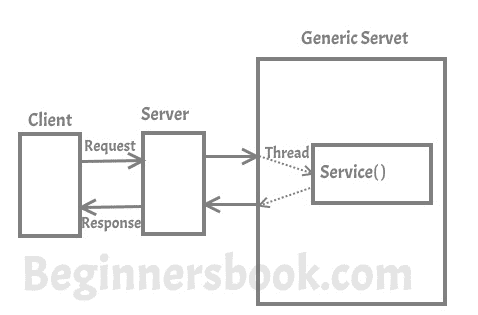
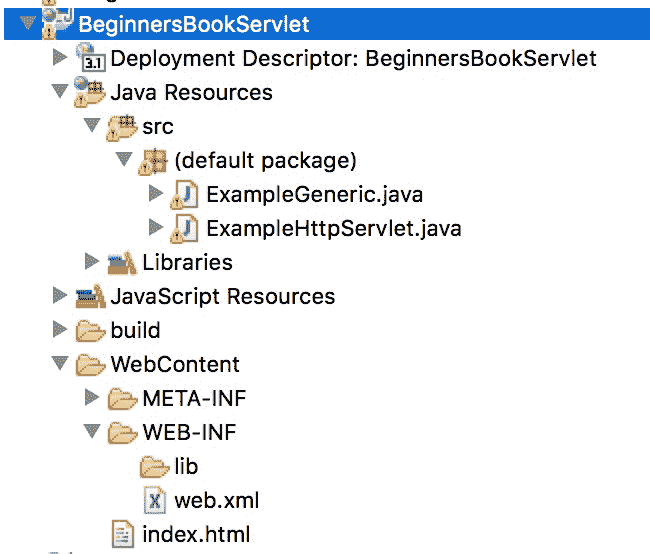
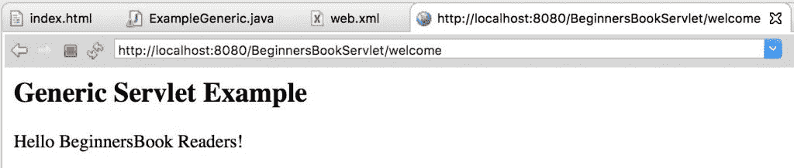

# GenericServlet 类与示例

> 原文： [https://beginnersbook.com/2014/04/genericservlet-class/](https://beginnersbook.com/2014/04/genericservlet-class/)

在讨论 [Servlet API](https://beginnersbook.com/2013/05/servlet-api/) 时，我已经讨论了一些关于 Generic Servlet 的内容。在本文中，我将详细讨论 Generic Servlet。

通用 servlet 是一个独立于协议的 Servlet，它应该始终覆盖 service（）方法来处理客户端请求。 service（）方法接受两个参数 ServletRequest 对象和 ServletResponse 对象。请求对象告诉 servlet 客户端发出的请求，而响应对象用于将响应返回给客户端。

### Generic Servlet 如何工作？



### 通用 Servlet 的层次结构

```
java.lang.Object
	|_extended byjavax.servlet.GenericServlet
```

GenericServlet 是一个抽象类，它只有一个抽象方法，即 service（）。这就是为什么当我们通过扩展 GenericServlet 类来创建 Generic Servlet 时，我们必须覆盖 service（）方法。

**使用 Generic Servlet 的优点：**
1.通用 Servlet 更容易编写
2.具有简单的生命周期方法
3.要编写 Generic Servlet，您只需要扩展 javax.servlet。 GenericServlet 并覆盖 service（）方法（请查看下面的示例）。

**使用 Generic Servlet 的缺点：**
使用 Generic Servlet 并不是那么容易，因为我们在 Generic Servlet 中没有像 doGet（），doPost（），doHead（）等方便的方法可以在 Http Servlet 中使用。
在 Http Servlet 中，我们需要为特定请求覆盖特定的便捷方法，例如，如果您需要获取信息，则覆盖 doGet（），如果要向服务器覆盖 doPost（）发送信息。但是在 Generic Servlet 中，我们只为每种类型的请求覆盖 service（）方法，这很麻烦。

我总是建议你使用 HttpServlet 而不是 GenericServlet。 HttpServlet 更易于使用，并且具有比 GenericServlet 更多的方法。

### GenericServlet 的示例

我在这个例子中使用 Eclipse IDE。从 Eclipse 文件菜单中创建新的“Dynamic Web Project”。

> 我已经解释了在 Eclipse IDE 中创建 Servlet 的每一步，但是如果您刚接触 Eclipse 并且没有在系统上安装它，那么请参考本指南：[如何安装 Eclipse，设置 Tomcat 并运行第一个 servlet 程序使用 Eclipse IDE。](https://beginnersbook.com/2017/07/how-to-create-and-run-servlet-in-eclipse-ide/)

完成后，在 IDE 中创建以下所有文件后，项目结构（或层次结构）将如下所示。


**index.html**
我们正在创建一个 html 文件，一旦我们点击网页上的链接就会调用 servlet。在 WebContent 文件夹中创建此文件。该文件的路径应如下所示：WebContent / index.html

```
<!DOCTYPE html>
<html>
<head>
<meta charset="UTF-8">
<title>Generic Servlet Demo</title>
</head>
<body>
<a href="welcome">Click to call Servlet</a>
</body>
</html>
```

**ExampleGeneric.java**
现在，我们通过扩展 GenericServlet 类来创建 Generic Servlet。创建 GenericServlet 时，应始终覆盖 service（）方法。右键单击 src 文件夹并创建一个新的类文件，将该文件命名为 ExampleGeneric。文件路径应如下所示：Java Resouces / src / default package / ExampleGeneric.java

```
import java.io.*;
import javax.servlet.*;

public class ExampleGeneric extends GenericServlet{
 public void service(ServletRequest req,ServletResponse res)
throws IOException,ServletException{
   res.setContentType("text/html");
   PrintWriter pwriter=res.getWriter();
   pwriter.print("<html>");
   pwriter.print("<body>");
   pwriter.print("<h2>Generic Servlet Example</h2>");
   pwriter.print("<p>Hello BeginnersBook Readers!</p>");
   pwriter.print("</body>");
   pwriter.print("</html>");
 }
}

```

**web.xml**
此文件可在此路径 WebContent / WEB-INF / web.xml 中找到。在此文件中，我们将使用特定 URL 映射 Servlet。由于我们在单击 index.html 页面上的链接时调用欢迎页面，因此我们将欢迎页面映射到我们上面创建的 Servlet 类。

```
<web-app>
<display-name>BeginnersBookServlet</display-name>
<welcome-file-list>
<welcome-file>index.html</welcome-file>
<welcome-file>index.htm</welcome-file>
<welcome-file>index.jsp</welcome-file>
<welcome-file>default.html</welcome-file>
<welcome-file>default.htm</welcome-file>
<welcome-file>default.jsp</welcome-file>
</welcome-file-list>

<servlet>
<servlet-name>MyGenericServlet</servlet-name>
<servlet-class>ExampleGeneric</servlet-class>
</servlet>

<servlet-mapping>
<servlet-name>MyGenericServlet</servlet-name>
<url-pattern>/welcome</url-pattern>
</servlet-mapping>

</web-app>
```

**输出：**

点击第一个屏幕中的链接后的屏幕：


## GenericServlet 类的方法：

以下是 GenericServlet 类的所有方法的列表。
1\. **public void init（）**：这是一种方便的方法。可以重写此方法，因此无需调用 super.init（config）。

2\. **public void init（ServletConfig config）**：由 servlet 容器调用以指示 servlet 正在投入使用，此方法用于初始化 servlet。

3\. **public String getInitParameter（String name）**：返回包含给定初始化参数值的 String，如果参数不存在，则返回 null。

4\. **public Enumeration getInitParameterNames（）**：返回 web.xml 文件中定义的所有参数的名称，如果 web.xml 没有任何参数，则返回 null。

5\. **public abstract void service（ServletRequest request，ServletResponse response）**：由 Servlet 容器调用，允许 servlet 响应客户端发出的请求。

6\. **public void destroy（）**：servlet 容器在 servlet 生命周期结束时调用一次，表明 servlet 正在被销毁。

7\. **public ServletConfig getServletConfig（）**：返回初始化此 servlet 的 ServletConfig 对象

8\. **public String getServletInfo（）**：返回有关 servlet 的信息。

9\. **public ServletContext getServletContext（）**：返回 ServletContext 对象，由 init 方法传递给这个 servlet

10\. **public String getServletName（）**：返回 servlet 实例的名称。

11\. **public void log（String msg）**：在 servlet 日志文件中写入给定的消息。

12\. **public void log（String msg，Throwable t）**：在 servlet 日志文件中写入解释性消息，包括描述错误或异常的 String。

#### 参考：

[GenericServlet 官方文档](https://docs.oracle.com/javaee/7/api/javax/servlet/GenericServlet.html)