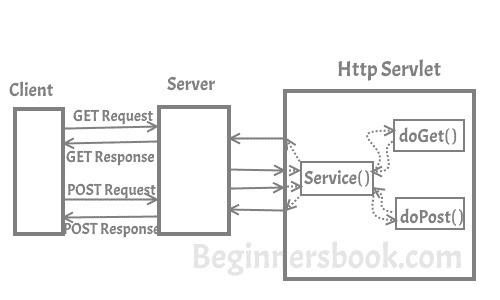
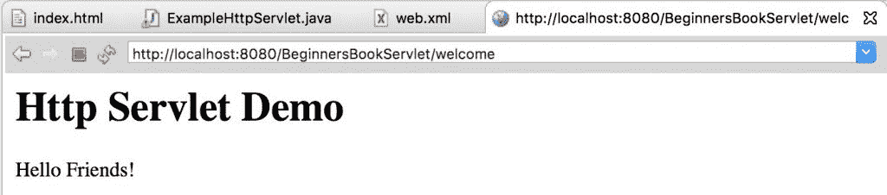

# HttpServlet 类有例子

> 原文： [https://beginnersbook.com/2013/05/http-servlet/](https://beginnersbook.com/2013/05/http-servlet/)

在 [Servlet API](https://beginnersbook.com/2013/05/servlet-api/) 中，我对 Http Servlet 进行了一些讨论。在本文中，我将详细讨论 Http Servlet。

与 Generic Servlet 不同，HTTP Servlet 不会覆盖 service（）方法。相反，它会覆盖 doGet（）方法或 doPost（）方法或两者。 doGet（）方法用于从服务器获取信息，而 doPost（）方法用于向服务器发送信息。

在 Http Servlet 中，不需要覆盖 service（）方法，因为此方法将 Http 请求分派给正确的方法处理程序，例如，如果它接收到 HTTP GET 请求，则会将请求分派给 doGet（）方法。

## Http Servlet 如何工作？

正如您在下图中看到的那样，客户端（用户的浏览器）发出请求。这些请求可以是任何类型，例如 - 获取请求，发布请求，头请求等。服务器将这些请求分派给 servlet 的 service（）方法，此方法将这些请求分派给正确的处理程序，例如，如果它接收到 Get 请求它将其分派给 doGet（）方法。


## Http Servlet 的层次结构

```java
java.lang.Object
	|_extended byjavax.servlet.GenericServlet
         	 |_extended byjavax.servlet.http.HttpServlet
```

我已经在 [Generic Servlet 文章](https://beginnersbook.com/2014/04/genericservlet-class/)中讨论过你应该总是使用 HttpServlet 而不是 GenericServlet。 HttpServlet 更易于使用，并且具有比 GenericServlet 更多的方法。

## Http Servlet 的例子

我在这个例子中使用 Eclipse IDE。从 Eclipse 文件菜单中创建新的“Dynamic Web Project”。

> 我已经解释了在 Eclipse IDE 中创建 Servlet 的所有步骤，但是如果您不熟悉 Eclipse 并且没有在系统上安装它，请参考本指南：[如何安装 Eclipse，配置 tomcat 并运行 First Servlet 使用 Eclipse](https://beginnersbook.com/2017/07/how-to-create-and-run-servlet-in-eclipse-ide/) 的应用程序。

完成后，在 IDE 中创建以下所有文件后，项目结构（或层次结构）将如下所示。


**index.html**
我们正在创建一个 html 文件，一旦我们点击网页上的链接就会调用 servlet。在 WebContent 文件夹中创建此文件。该文件的路径应如下所示：WebContent / index.html

```java
index<!DOCTYPE html>
<html>
<head>
<meta charset="UTF-8">
<title>Http Servlet Demo</title>
</head>
<body>
<a href="welcome">Click to call Servlet</a>
</body>
</html>

```

**ExampleHttpServlet.java**
现在，我们通过扩展 HttpServlet 类来创建一个 Http Servlet。右键单击 src 文件夹并创建一个新的类文件，将该文件命名为 ExampleHttpServlet。文件路径应如下所示：Java Resources / src / default package / ExampleHttpServlet.java

```java
import java.io.*;
import javax.servlet.*;
import javax.servlet.http.*;
// Creating Http Servlet by Extending HttpServlet class
public class ExampleHttpServlet extends HttpServlet 
{    
    private String mymsg;
    public void init() throws ServletException 
    {      
       mymsg = "Http Servlet Demo";   
    }
    public void doGet(HttpServletRequest request, 
        HttpServletResponse response) throws ServletException, 
        IOException 
    {            
        // Setting up the content type of web page      
        response.setContentType("text/html");
        // Writing the message on the web page      
        PrintWriter out = response.getWriter();      
        out.println("<h1>" + mymsg + "</h1>");      
        out.println("<p>" + "Hello Friends!" + "</p>");   
    }
    public void destroy() 
    {      
       // Leaving empty. Use this if you want to perform  
       //something at the end of Servlet life cycle.   
    }
}
```

**web.xml**
此文件可在此路径 WebContent / WEB-INF / web.xml 中找到。在此文件中，我们将使用特定 URL 映射 Servlet。由于我们在单击 index.html 页面上的链接时调用欢迎页面，因此我们将欢迎页面映射到我们上面创建的 Servlet 类。

```java
<web-app>
<display-name>BeginnersBookServlet</display-name>
<welcome-file-list>
<welcome-file>index.html</welcome-file>
<welcome-file>index.htm</welcome-file>
<welcome-file>index.jsp</welcome-file>
<welcome-file>default.html</welcome-file>
<welcome-file>default.htm</welcome-file>
<welcome-file>default.jsp</welcome-file>
</welcome-file-list>

<servlet>
<servlet-name>MyHttpServlet</servlet-name>
<servlet-class>ExampleHttpServlet</servlet-class>
</servlet>

<servlet-mapping>
<servlet-name>MyHttpServlet</servlet-name>
<url-pattern>/welcome</url-pattern>
</servlet-mapping>

</web-app>

```

**运行项目：**
右键单击 index.html，在服务器上运行。

**输出：**


单击链接后，您将看到此屏幕：


## HttpServlet 类的方法

1\. **protected void doGet（HttpServletRequest req，HttpServletResponse resp）**：这个方法由 servlet 服务方法调用，以处理来自客户端的 HTTP GET 请求。覆盖此方法时，请读取请求数据，编写响应头，获取响应的编写器或输出流对象，最后编写响应数据。

2\. **protected long getLastModified（HttpServletRequest req）**：返回一个长整数，指定上次修改 HttpServletRequest 对象的时间，格林威治标准时间 1970 年 1 月 1 日午夜（以秒为单位），如果时间不知道，则返回-1

3\. **protected void doHead（HttpServletRequest req，HttpServletResponse resp）**：这个方法由 servlet 服务方法调用，以处理来自客户端的 HTTP HEAD 请求。当客户端想要仅查看响应的标头（例如 Content-Type 或 Content-Length）时，它会发送 HEAD 请求

4\. **protected void doPost（HttpServletRequest req，HttpServletResponse resp）**：servlet 服务方法调用此方法来处理来自客户端的 POST 请求。 HTTP POST 方法允许客户端一次性向 Web 服务器发送无限长度的数据，并且在向服务器发布信息时非常有用。与 doGet 不同，我们从服务器获取信息时，在从客户端向服务器传输信息时使用此方法。

5\. **protected void doPut（HttpServletRequest req，HttpServletResponse resp）**：这个方法由 servlet 服务方法调用，以处理来自客户端的 PUT 请求。此方法类似于 doPost 方法，但与我们向服务器发送信息的 doPost 方法不同，此方法将文件发送到服务器，这类似于从客户端到服务器的 FTP 操作。

6\. **protected void doDelete（HttpServletRequest req，HttpServletResponse resp）**：由 servlet service（）方法调用，以处理来自客户端的 DELETE 请求，允许客户端从服务器删除文档，网页或信息。

7\. **protected void doOptions（HttpServletRequest req，HttpServletResponse resp）**：由服务方法调用，以允许 servlet 处理 OPTIONS 请求。 OPTIONS 请求确定服务器支持哪些 HTTP 方法并返回适当的标头。

8\. **protected void doTrace（HttpServletRequest req，HttpServletResponse resp）**：此方法由 service（）方法调用，用于处理 TRACE 请求。用于调试目的。

9\. **protected void service（HttpServletRequest req，HttpServletResponse resp）**：没有必要覆盖此方法，此方法从客户端接收 HTTP 请求并将它们转发到相应的 doXXX 方法，如 doGet（）， doPost（），doHEAD（）等

10\. **public void service（ServletRequest req，ServletResponse res）**：将客户端请求转发给受保护的服务方法。也没有必要重写此方法。

**参考：** [Http Servlet 官方文档](https://docs.oracle.com/javaee/7/api/javax/servlet/http/HttpServlet.html)