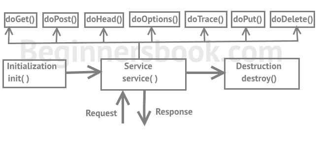

# Servlet 生命周期

> 原文： [https://beginnersbook.com/2013/05/servlet-life-cycle/](https://beginnersbook.com/2013/05/servlet-life-cycle/)

Servlet 生命周期可以描述为 servlet 在其生命周期中从一系列步骤开始，从加载开始直到它被破坏。

在我开始解释 Servlet 的生命周期之前，我们先讨论一下您在阅读本指南时会遇到的几个术语。了解每个术语的含义非常重要，这将有助于您更快地理解事物。

**Web 服务器**：它也称为 HTTP 服务器，它可以处理客户端发送的 HTTP 请求，并使用 HTTP 响应来响应请求。

**Web 容器**：也称为 Servlet 容器和 Servlet 引擎。它是 Web Server 的一部分，与 Servlet 交互。这是管理 Servlet 生命周期的 Web Server 的主要组件。

> 注意：您在本网站中找到的 servlet 教程使用 apache tomcat web 服务器。虽然我将其称为 Web 服务器，但它实际上是一个 Web 服务器和 Web 容器。 （如上所述，Web 容器是 Web 服务器的一部分）。

## Servlet 的生命周期

Servlet 生命周期包含五个步骤：1）加载 Servlet 2）创建 Servlet 实例 3）调用 init（）一次 4）为每个客户端请求重复调用 service（）5）调用 destroy（）

> 对于那些想知道什么是实例和调用的人来说：实例和对象是一回事。调用方法意味着调用一个方法，它只是一个奇特的词，我们在编程世界中使用而不是调用:)

让我们回到主题。以下是 servlet 生命周期的五个步骤。

**步骤 1：加载 Servlet**

当 Web 服务器（例如 Apache Tomcat）启动时，servlet 容器部署并加载所有 servlet。

**步骤 2：创建 Servlet 实例**

一旦加载了所有 Servlet 类，servlet 容器就会创建每个 servlet 类的实例。 Servlet 容器每个 servlet 类只创建一个实例，并且对 servlet 的所有请求都在同一个 servlet 实例上执行。

**步骤 3：调用 init（）方法**

一旦实例化了所有 servlet 类，就会为每个实例化的 servlet 调用 init（）方法。此方法初始化 servlet。您可以在部署描述符（web.xml）文件中指定某些 init 参数。例如，如果 servlet 的值&gt; gt = 0，则在 Web 容器启动期间立即调用其 init（）方法。

您可以在 web.xml 文件中指定元素，如下所示：

```java
<servlet>
 <servlet-name>MyServlet</servlet-name>
 <servlet-class>com.beginnersbook.MyServletDemo</servlet-class>
 <load-on-startup>1</load-on-startup>
</servlet>

```

现在，在 Web 容器启动期间将调用相应 servlet 类 **com.beginnersbook.MyServletDemo** 的 init（）方法。

**注意：init（）方法在 servlet 的生命周期中只调用一次。**

**步骤 4：调用 service（）方法**

每次 Web 服务器收到 servlet 请求时，它都会产生一个调用 service（）方法的新线程。如果 servlet 是 GenericServlet，那么请求由 service（）方法本身提供，如果 servlet 是 HttpServlet，则 service（）方法接收请求并根据请求的类型将其分派给正确的处理程序方法。

例如，如果它是 Get Request，则 service（）方法会通过使用请求参数调用 doGet（）方法将请求分派给 doGet（）方法。类似地，诸如 Post，Head，Put 等的请求被 servlet 的 service（）方法分派给相应的处理程序 doPost（），doHead（），doPut（）等。



**注意**：与只调用一次的 init（）和 destroy（）不同，在 servlet 生命周期中可以多次调用 service（）方法。只要不销毁 servlet，就会为每个客户端请求调用 service（）方法。

**在生命周期的所有 5 个步骤中，这是多次执行的唯一步骤。**

**步骤 5：调用 destroy（）方法**

当 servlet 容器关闭时（这通常在我们停止 Web 服务器时发生），它卸载所有 servlet 并为每个初始化的 servlet 调用 destroy（）方法。